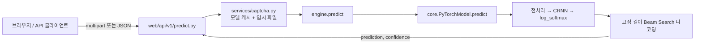

# Hyper Captcha Solver

CRNN + CTC 기반 캡차(CAPTCHA) 문자 인식 서비스입니다. 학습(PyTorch), 배치 평가, CLI 단일 예측, FastAPI 웹 UI/REST API를 하나의 저장소에서 제공합니다.

- **모델**: CNN(3 블록) → Feature Projection → 양방향 LSTM(2층) → CTC
- **손실 함수**: 표준 CTC / Focal CTC 선택
- **디코딩**: 고정 길이 Beam Search (레이블 길이를 알고 있는 캡차에 최적화)
- **서빙**: FastAPI + Jinja2 템플릿 웹 UI, JSON/멀티파트 REST API
- **캡차별 설정 분리**: `captcha_id` 하나로 전처리·이미지 크기·문자셋·모델 경로가 모두 결정됨

---

## 목차

1. [요구사항 및 설치](#요구사항-및-설치)
2. [빠른 시작](#빠른-시작)
3. [프로젝트 구조](#프로젝트-구조)
4. [아키텍처](#아키텍처)
5. [데이터 규칙](#데이터-규칙)
6. [지원 캡차 타입](#지원-캡차-타입)
7. [이미지 전처리와 증강](#이미지-전처리와-증강)
8. [모델 상세](#모델-상세)
9. [학습](#학습)
10. [평가 및 배치 예측](#평가-및-배치-예측)
11. [CLI](#cli)
12. [웹 UI 및 REST API](#웹-ui-및-rest-api)
13. [서비스 설정 (DB)](#서비스-설정-db)
14. [환경 변수](#환경-변수)
15. [Docker 배포](#docker-배포)
16. [제약 사항과 주의점](#제약-사항과-주의점)

---

## 요구사항 및 설치

| 항목 | 값 |
|------|-----|
| Python | 3.12.x 고정 (`requires-python = "==3.12.*"`) |
| 패키지 매니저 | [uv](https://docs.astral.sh/uv/) (`uv.lock`이 단일 소스) |
| 주요 의존성 | torch, torchvision, fastapi[standard], pillow, pandas, scikit-learn, pydantic-settings, tqdm, onnx |
| GPU | 선택 사항. CUDA가 없으면 자동으로 CPU 사용 |

```bash
uv sync                     # 의존성 설치 (.venv 생성)
cp .env.example .env        # 필요 시 환경 변수 수정
```

PyTorch는 `pyproject.toml`의 추가 인덱스(`https://download.pytorch.org/whl/cu130`)에서 CUDA 13.0 휠을 받습니다. CPU 전용 환경이라면 해당 인덱스를 제거하고 `uv lock`을 다시 생성하세요.

---

## 빠른 시작

```bash
# 1) 웹 서버 (개발) — http://localhost:8000
uv run fastapi dev web/app.py

# 2) 웹 서버 (운영)
uv run fastapi run web/app.py --host 0.0.0.0 --port 8000

# 3) 단일 이미지 예측 (CLI)
uv run python main.py -c supreme_court -i captcha_data/supreme_court/0/images/pred/091082.png

# 4) 컨테이너 — http://localhost:5001
docker compose up --build
```

`fastapi dev`는 `fastapi_dev.py`가 감싸고 있어 호스트/포트를 생략하면 `0.0.0.0:8000`이 자동 적용됩니다.

---

## 프로젝트 구조

```
captcha-solver/
├── core.py             # CRNN 모델, FocalCTCLoss, SpecAugment, Transform, PyTorchModel
├── base_core.py        # BaseModel 추상 클래스 (모델 구현 공통 인터페이스)
├── dataclass.py        # TrainData / CaptchaType (Pydantic). 경로·문자셋·전처리
├── engine.py           # 사용 진입점: 모델 생성, 학습, 예측, 배치 평가, 데이터 재분배
├── main.py             # CLI 단일 예측 (+ 파일 로깅, PyInstaller 대응)
├── train.py            # 학습 실행 스크립트 (상단 변수 직접 수정)
├── pred.py             # 배치 평가 실행 스크립트 (상단 변수 직접 수정)
├── fastapi_dev.py      # `fastapi` CLI 래퍼 (dev 기본 인자 주입)
├── main.spec           # PyInstaller 번들 스펙 (CLI 단일 실행 파일)
├── docs/crnn_ctc.md    # 모델·학습 파이프라인 상세 문서
├── db/schema.sql       # SQLite 스키마 (service_captchas = 서비스 대상/기본 캡차)
├── captcha_data/       # 캡차별 학습/추론 이미지와 학습된 모델
└── web/                # FastAPI 애플리케이션
    ├── app.py               # create_app(): 라우터/정적파일/템플릿 조립
    ├── core/config.py       # Settings (pydantic-settings, .env 로드)
    ├── core/db.py           # SQLite 연결, 스키마 적용, 서비스 설정 로드
    ├── core/version.py      # 앱 버전 조회 (pyproject.toml 우선)
    ├── frontend/router.py   # `/` 예측 페이지, `/status` 모델 상태 페이지
    ├── api/system.py        # `/health`, `/ping`, `/version`
    ├── api/v1/predict.py    # `/api/v1/predictImage`, `/api/v1/predictJson`
    ├── schemas/predict.py   # 요청/응답 Pydantic 모델
    ├── services/captcha.py  # 모델 프리로드/캐시, 상태 조회, base64 디코딩, 예측
    ├── templates/base.html  # 공통 셸 (사이드바/헤더/테마, Tailwind + Pretendard)
    ├── templates/index.html # 예측 페이지
    ├── templates/status.html# 모델 상태 페이지
    └── static/              # theme.js(공통) / app.js(예측), favicon, Tailwind 번들
```

루트 모듈은 패키지가 아닌 **평면 모듈**입니다(`import engine`, `from core import PyTorchModel`).

---

## 아키텍처

### 예측 요청 흐름



- **서버 기동 시 등록된 모든 캡차 모델을 로드하고 더미 입력으로 워밍업**합니다(`preload_models()`, FastAPI lifespan). 학습된 모델이 없는 캡차는 건너뛰며 기동을 막지 않습니다.
- 로드된 모델은 `web/services/captcha.py`의 `_MODEL_CACHE`에 `captcha_id`별로 프로세스 메모리에 상주합니다.
- 업로드된 바이트는 `tempfile.TemporaryDirectory()` 안에 잠깐 저장한 뒤 예측이 끝나면 삭제됩니다.
- `engine`(과 그 안의 `torch`)은 모듈 최상단이 아니라 함수 안에서 임포트되므로, 웹 모듈 임포트 자체는 가볍고 GPU 초기화는 기동 단계에서 한 번에 일어납니다.

### 레이어 역할

| 레이어 | 파일 | 책임 |
|--------|------|------|
| 설정/도메인 | `dataclass.py` | 캡차별 경로 규칙, 문자셋, 이미지 전처리, 학습 정보 자동 감지 |
| 모델 | `core.py` | CRNN 정의, 학습 루프, 저장/로드, ONNX·TorchScript 내보내기, 디코딩 |
| 오케스트레이션 | `engine.py` | 캡차 타입 목록, 모델 팩토리, 학습/예측/배치 평가/데이터 재분배 |
| 서비스 | `web/services/captcha.py` | 모델 캐싱, base64 디코딩, 바이트 → 예측 |
| 전달 | `web/api/*`, `main.py` | HTTP 라우팅, CLI 인자 처리 |

---

## 데이터 규칙

```
captcha_data/<captcha_id>/<rev>/
├── images/
│   ├── train/   # 학습용 PNG
│   ├── pred/    # 검증/배치 평가용 PNG
│   └── draft/   # 실제 수집 원본(선택)
└── model/
    ├── model_full.pt       # state_dict (기본 추론 대상)
    ├── model_jit.pt        # TorchScript (선택)
    └── model_full.pt.onnx  # ONNX (선택)
```

- **파일명이 곧 정답 레이블입니다.** `091082.png` → 레이블 `091082`.
- `TrainData`는 생성 시 `images/train`을 스캔해 **이미지 크기·레이블 길이·문자 집합을 자동 감지**합니다(`_detect_and_cache`). 학습 파일이 없으면 생성자 기본값을 사용합니다.
- `get_data_files()`는 감지된 레이블 길이와 파일명 길이가 다른 이미지를 걸러냅니다.
- `rev`는 같은 캡차의 세대 구분용입니다(예: `gov24`는 `rev=1` 사용).

### train/pred 재분배

```python
import engine
engine.redistribute_train_pred(image_dir="captcha_data/supreme_court/0/images", train_ratio=0.9)
```

`pred`의 파일을 `train`으로 모은 뒤 고정 시드(기본 42)로 섞어 비율대로 다시 나눕니다. 결과 통계를 dict로 반환합니다.

---

## 지원 캡차 타입

`engine.get_captcha_type_list()`에 하드코딩되어 있습니다.

| captcha_id | 이름 | 이미지 크기 | 레이블 길이 | 특이 사항 |
|------------|------|-------------|-------------|-----------|
| `default` | 기본 캡챠 | 200×50 | 5 | 문자셋 `2345678bcdefgmnpwxy` |
| `dev` | 개발중 | 200×50 | 6 | 문자셋 `2345678ABCDEFGHKLMNPRSTUVWYZabcdefhklmnoprstuvwyz` |
| `supreme_court` | 대법원 | 120×40 | 자동 감지 | 전용 크롭 전처리 |
| `gov24` | 정부24 | 200×50 | 자동 감지 | `threshold=60`(이진화), `rev=1` |
| `wetax` | WETAX | 200×60 | 자동 감지 | — |
| `kshop` | KT Shopping | 263×54 | 자동 감지 | — |

> 표의 이미지 크기·레이블 길이는 생성자 기본값이며, `images/train`에 파일이 있으면 감지값이 우선합니다.

새 캡차를 추가하려면 `get_captcha_type_list()`에 `CaptchaType` 항목을 추가하고 `captcha_data/<id>/0/images/train`에 라벨링된 PNG를 넣으면 됩니다.

---

## 이미지 전처리와 증강

### 공통 전처리 (`TrainData.image_pre_process`)

1. RGBA → 흰 배경 합성 후 RGB
2. 그레이스케일 변환(`L`)
3. `0 < threshold < 255`인 경우 임계값 이진화
4. 테두리 2px 크롭
5. 128 초과 픽셀을 255로 밀어 배경 백색화
6. 감지된 크기로 리사이즈

`supreme_court`는 예외적으로 고정 ROI를 크롭해 캔버스에 다시 붙이는 전용 경로(`_supreme_court_preprocess`)를 사용합니다.

### 학습 증강 (`get_train_transform`)

| 변환 | 파라미터 |
|------|----------|
| `RandomAffine` | 회전 ±5°, 이동 5%, 스케일 0.95–1.05, shear 0–3°, 여백 255 |
| `RandomPerspective` | distortion 0.1, p=0.3 |
| `RandomGrayscale` | p=0.1 (외곽 `RandomApply` p=0.2) |
| `GaussianBlur` | kernel 3, sigma 0.1–0.5, p=0.3 |
| `ColorJitter` | brightness/contrast 0.4, saturation 0.2, p=0.3 |
| `RandomErasing` | p=0.15, scale 1–5% |

추론·검증에는 증강이 없는 `get_eval_transform`이 쓰입니다.

---

## 모델 상세

### CRNN (`core.CRNN`)

| 단계 | 구성 | 출력 |
|------|------|------|
| Block 1 | Conv3×3 ×2 (64) + BN + GELU + MaxPool 2×2 + Dropout2d | H/2, W/2 |
| Block 2 | Conv3×3 ×2 (128) + BN + GELU + MaxPool 2×2 + Dropout2d | H/4, W/4 |
| Block 3 | Conv3×3 ×2 (256) + BN + GELU + MaxPool (2,1) | H/8, W/4 |
| Projection | Linear(C·H → 256) + LayerNorm + GELU + Dropout | (N, T, 256) |
| RNN | BiLSTM 2층, hidden 128, `batch_first=True` | (N, T, 256) |
| Head | Linear(256→128) + GELU + Dropout + Linear(128→클래스+1) | (T, N, C) |

- 시간축 `T`는 CNN 출력의 너비이며, **`T >= label_length`가 아니면 생성자에서 `ValueError`** 를 던집니다.
- 클래스 인덱스 0은 CTC blank로 예약되어 있고 문자 인덱스는 1부터 시작합니다.
- `SpecAugment`(시간/주파수 마스킹)는 학습 모드에서만 특징 맵에 적용됩니다.

### 손실 함수

| `loss_type` | 설명 |
|-------------|------|
| `ctc` | 표준 `nn.CTCLoss` |
| `focal` | `FocalCTCLoss` — 샘플별 CTC loss에 `alpha·(1-p)^gamma` 가중치(기본 alpha 0.25, gamma 2.0). 어려운 샘플에 집중 |

### 디코딩 (`ctc_beam_decode_fixed_length`)

레이블 길이가 고정된 캡차를 전제로 한 CTC Prefix Beam Search입니다.

- prefix마다 blank로 끝나는 경로(`p_b`)와 문자로 끝나는 경로(`p_nb`)를 분리해 log-sum-exp로 **합산**합니다. beam 점수가 곧 `P(문자열 | 이미지)`이며 단일 정렬 경로 확률이 아닙니다.
- 기대 길이는 하드 제약입니다. 초과하는 prefix를 만들지 않고, 남은 프레임으로 길이를 채울 수 없는 prefix는 즉시 버립니다.
- 프레임마다 상위 `beam_width * 2`개 문자만 확장해 탐색 비용을 줄입니다(blank는 항상 포함).
- **신뢰도 = 최종 후보 집합에서 정규화한 사후확률** `exp(best - logsumexp(all))`. 1위가 압도적이면 1.0에 가깝고, 2위와 접전이면 0.5 부근으로 떨어집니다.

`test_ctc_decode.py`가 이 로직을 검증합니다(정렬 경로 합산, 동률 시 0.5, 반복 문자, 길이 제약, 신뢰도 범위).

```bash
uv run python test_ctc_decode.py
```

### 실행 최적화

- `cudnn.benchmark`, TF32 활성화 (`core.py` 임포트 시 전역 적용)
- venv 휠 cuDNN과 시스템 cuDNN 버전이 섞여 conv가 죽는 경우를 감지해 cuDNN을 자동 비활성화(느려지지만 동작)
- AMP(`use_amp`, float16) 학습·추론, `torch.inference_mode()` 추론
- `use_compile=True` 시 `torch.compile`(CUDA에서는 `reduce-overhead` 모드)

---

## 학습

`train.py` 상단 변수를 수정한 뒤 실행합니다(인자 방식이 아닙니다).

```python
captcha_id = 'supreme_court'
loss_type = 'focal'      # 'ctc' | 'focal'
use_amp = True
batch_size = 64
epochs = 40
early_stopping_patience = 6
shuffle = False          # True면 train/pred 재분배 후 학습
```

```bash
uv run python train.py
```

내부적으로 `engine.train_model()`이 다음을 수행합니다.

| 파라미터 | 기본값 | 설명 |
|----------|--------|------|
| `epochs` | 60 | 학습 에폭 |
| `batch_size` | 32 | 배치 크기 |
| `learning_rate` | 0.001 | 초기 학습률 |
| `early_stopping_patience` | 8 | 개선 없는 에폭 허용치 (0이면 비활성화) |
| `warmup_epochs` | 0 | LR 워밍업 |
| `num_workers` | 0 | DataLoader 워커 수 |
| `loss_type` | `focal` | 손실 함수 |
| `use_amp` | True | 혼합 정밀도 |

- 데이터 분할은 `images/train` 내부에서 8:2(학습/검증)로 이루어집니다. `images/pred`는 배치 평가용으로 별도 보관됩니다.
- 검증 손실이 개선될 때마다 `model_full.pt.tmp`에 체크포인트를 남기고, 학습 종료 시 이를 `model_full.pt`로 승격합니다(= 최종 산출물은 최적 가중치).
- 학습이 끝나면 `model_jit.pt`(TorchScript)와 `model_full.pt.onnx`(ONNX)도 자동으로 함께 생성됩니다.

---

## 평가 및 배치 예측

```bash
uv run python pred.py
```

`engine.batch_predict_model()`이 `images/pred`의 모든 이미지를 예측해 파일명(정답)과 비교하고, 이미지별 성공/실패와 전체 정확도·소요 시간을 출력합니다.

```
✅ 091082.png: 091082 ➡️ 091082 (conf: 0.6938)
❌ 730915.png: 730915 ➡️ 730916 (conf: 0.4120)
...
  Total: 250   Match: 241   Accuracy: 96.40%
```

---

## CLI

```bash
uv run python main.py -c <captcha_id> -i <image_path> [-v]
```

| 옵션 | 기본값 | 설명 |
|------|--------|------|
| `-c, --captcha-id` | `supreme_court` | 사용할 캡차 모델 |
| `-i, --image-path` | 번들 내 샘플 이미지 | 예측할 이미지 경로 |
| `-v, --verbose` | off | 상세 로그 + JSON 출력 |

- 기본 모드는 예측 문자열만 개행 없이 출력하므로 셸 파이프라인에 바로 쓸 수 있습니다.
- `-v` 사용 시 `{"predicted_text", "confidence", "execution_time"}` JSON을 출력하고 `logs/main.log`에 기록합니다.
- 종료 코드: `2` 이미지 없음, `3` 모델 생성 실패.
- `main.spec`으로 PyInstaller 단일 실행 파일 빌드를 지원합니다(모델·샘플 이미지 동봉).

---

## 웹 UI 및 REST API

### 웹 UI (`/`)

- Captcha ID 드롭다운 선택 (`engine.get_captcha_type_list()`의 등록 목록을 그대로 렌더링)
- 캡차 이미지 드래그 앤 드롭 + 클릭 업로드(미리보기 포함)
- 예측 문자열·신뢰도 게이지(소수점 2자리 버림)·소요 시간(ms)·원본 JSON 응답 표시
- 라이트 / 다크 / 시스템 테마 전환(localStorage 저장, 시스템 설정 변경 추종)
- Tailwind CSS(브라우저 번들 로컬 동봉) + Pretendard 폰트

### 엔드포인트

| 메서드 | 경로 | 설명 |
|--------|------|------|
| GET | `/` | 예측 웹 UI |
| GET | `/status` | 로드된 모델 상태 (카드) |
| GET | `/health` | 서비스 상태 + 기본/서비스 대상/로드된 캡차 목록 (Docker 헬스체크에서 사용) |
| GET | `/ping` | `{"ping": "pong"}` |
| GET | `/version` | 앱 버전 |
| POST | `/api/v1/predictImage` | 멀티파트 이미지 업로드 예측 |
| POST | `/api/v1/predictJson` | base64 이미지 문자열 예측 |
| GET | `/docs`, `/redoc` | FastAPI 자동 문서 |

#### `POST /api/v1/predictImage`

```bash
curl -X POST http://localhost:8000/api/v1/predictImage \
  -F "captcha_id=supreme_court" \
  -F "image=@captcha_data/supreme_court/0/images/pred/091082.png"
```

| 필드 | 필수 | 설명 |
|------|------|------|
| `image` | 예 | 이미지 파일 (multipart) |
| `captcha_id` | 아니오 | 생략 시 DB의 기본 캡차(`supreme_court`) 사용. 서비스 대상이 아니면 400 |

#### `POST /api/v1/predictJson`

```bash
curl -X POST http://localhost:8000/api/v1/predictJson \
  -H "Content-Type: application/json" \
  -d '{"captcha_id": "supreme_court", "image_data": "iVBORw0KGgo..."}'
```

`image_data`는 순수 base64 또는 `data:image/png;base64,...` 형식을 모두 허용합니다.

#### 공통 응답

```json
{
  "captcha_id": "supreme_court",
  "prediction": "091082",
  "confidence": 0.9999999993,
  "elapsed_ms": 13
}
```

`elapsed_ms`는 요청 진입부터 응답 직전까지의 서버 처리 시간(밀리초 정수)입니다. 모델은 기동 시 미리 로드되므로 첫 요청도 가중치 로드 비용을 물지 않습니다.

| 상태 코드 | 상황 |
|-----------|------|
| 400 | 이미지 누락, 빈 데이터, 잘못된 base64 |
| 500 | 모델 로드 실패 등 예측 중 오류 (`CaptchaPredictionError`) |

---

## 서비스 설정 (DB)

어떤 캡차를 서비스할지와 기본 캡차 ID는 SQLite 테이블 `service_captchas`가 결정합니다. 스키마와 초기값은 `db/schema.sql`에 있고, 서버 기동 시 `init_db()`가 적용합니다(`IF NOT EXISTS` / `INSERT OR IGNORE`라 반복 실행해도 안전).

| captcha_id | enabled | is_default | 비고 |
|------------|---------|------------|------|
| `supreme_court` | 1 | 1 | 기본 캡차 |
| `gov24` | 1 | 0 | |
| `wetax` | 1 | 0 | |
| `kshop` | 1 | 0 | |

- 기동 시 서비스 대상 모델만 로드·워밍업합니다.
- 웹 UI의 Captcha ID 드롭다운에도 서비스 대상만 노출됩니다.
- 대상이 아닌 `captcha_id`로 예측을 요청하면 `400 captcha_id '<id>' is not serviced`.
- `is_default`는 부분 유니크 인덱스로 **한 행만** 가질 수 있습니다.

```sql
-- 서비스 대상 추가/제외
UPDATE service_captchas SET enabled = 0 WHERE captcha_id = 'kshop';
INSERT OR REPLACE INTO service_captchas(captcha_id, enabled, is_default, sort_order) VALUES ('dev', 1, 0, 4);

-- 기본 캡차 변경 (기존 기본값을 먼저 해제)
UPDATE service_captchas SET is_default = 0 WHERE is_default = 1;
UPDATE service_captchas SET is_default = 1 WHERE captcha_id = 'gov24';
```

변경 후에는 서버를 재시작해야 반영됩니다(설정은 기동 시 1회 로드).

---

## 환경 변수

`.env`(프로젝트 루트) 또는 프로세스 환경 변수로 지정합니다. `.env.example`을 복사해 사용하세요.

| 변수 | 기본값 | 설명 |
|------|--------|------|
| `DEFAULT_CAPTCHA_ID` | `supreme_court` | DB에 서비스 설정이 없을 때만 쓰이는 폴백 기본값 |
| `WEB_HOST` | `0.0.0.0` | 바인딩 호스트 |
| `WEB_PORT` | `5000` | `python web/app.py` 직접 실행 시 포트 |
| `WEB_DEBUG` | `false` | uvicorn reload |
| `APP_TITLE` | `Captcha Solver` | FastAPI 문서 제목 |
| `DB_PATH` / `DB_SCHEMA_PATH` | `./db/captchaSolver.sqlite3` / `./db/schema.sql` | 서비스 설정 DB 경로와 스키마 경로 |
| `DB_DRIVER` / `DATABASE_URL` | SQLite 기본값 | 현재 코드에서 사용하지 않습니다(stdlib `sqlite3`로 `DB_PATH`만 사용) |

> `fastapi run/dev`로 실행할 때의 포트는 CLI 인자를 따르며 `WEB_PORT`는 적용되지 않습니다.

---

## Docker 배포

```bash
docker compose up --build      # http://localhost:5001
```

- 베이스 이미지: `ghcr.io/astral-sh/uv:python3.12-bookworm-slim`
- 의존성 레이어를 먼저 설치해 캐시를 살리고, `uv sync --frozen --no-dev`로 잠금 파일을 그대로 재현합니다.
- 컨테이너는 8000 포트에서 `fastapi run web/app.py`를 실행하고, compose가 호스트 5001로 매핑합니다.
- `captcha_data/`는 읽기 전용 볼륨으로 마운트됩니다 — 학습된 모델을 이미지에 굽지 않고 호스트에서 교체할 수 있습니다.
- 헬스체크는 30초 간격으로 `/health`를 호출합니다.
- compose가 `DEFAULT_CAPTCHA_ID=gov24`를 넣지만, DB에 서비스 설정이 있으면 DB 값이 우선합니다.

---

## 제약 사항과 주의점

- **CTC 시간축 제약**: `CNN 출력 너비(T) >= 레이블 길이`. 위반하면 모델 생성 단계에서 예외가 발생합니다. 이미지 폭을 키우거나 풀링을 줄이세요.
- **고정 길이 디코딩**: `predict()`는 `label_length`가 정해진 캡차를 전제로 합니다. 가변 길이 캡차는 별도 디코더가 필요합니다.
- **레이블은 파일명에서만 옵니다.** 라벨링 실수는 그대로 학습 오류가 됩니다.
- `core.py`는 임포트만으로 cuDNN/TF32 설정과 CUDA 프로브를 수행합니다. 단순 임포트 체크 용도로 불러오지 마세요.
- `train.py` / `pred.py`는 인자를 받지 않습니다. 상단 변수를 직접 수정하는 방식입니다.
- 서비스 대상 캡차는 DB(`service_captchas`)가 결정합니다. 대상이 아닌 `captcha_id`로 예측을 요청하면 400을 반환합니다. 값을 바꾼 뒤에는 **서버 재시작**이 필요합니다(설정은 기동 시 1회 로드).
- 모델 아키텍처는 CRNN 단일 구현입니다. 다른 백엔드를 붙이려면 `base_core.BaseModel`을 구현하세요.

---

## 참고 문서

- `docs/crnn_ctc.md` — CRNN/CTC 아키텍처, 학습·추론 파이프라인 상세
- `AGENTS.md` — 코딩 에이전트를 위한 저장소 규약 요약
