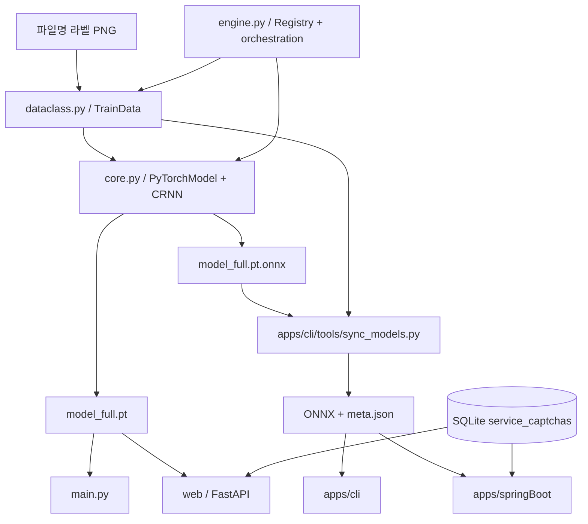

# Captcha Solver 코드베이스 분석

> 분석 기준: 2026-08-09 작업 트리. 루트 Python 구현과 `apps/cli` Rust CLI, `apps/springBoot` Spring Boot 서비스를 함께 다룬다.

## 개요

이 저장소는 파일명으로 라벨링한 CAPTCHA PNG를 CRNN으로 학습하고, 고정 길이 CTC 디코딩으로 인식하는 다중 런타임 프로젝트다. Python은 데이터 규칙·학습·PyTorch 추론·모델 내보내기의 기준 구현이다. FastAPI는 이를 HTTP로 제공하며, Rust와 Spring Boot는 ONNX 모델과 JSON 메타데이터를 사용해 Python 없이 추론한다.

## 구성요소와 경계

| 구성요소 | 경로 | 책임 |
|---|---|---|
| 데이터/도메인 | `dataclass.py` | CAPTCHA별 경로, 학습 이미지 감지, 문자셋·레이블 길이, 전처리 |
| 모델 | `core.py` | CRNN, 학습/검증, 저장·ONNX/TorchScript 내보내기, CTC 디코더 |
| 엔진 | `engine.py` | CAPTCHA 레지스트리, 모델 팩토리, 학습·단건/배치 예측·재분배 진입점 |
| Python CLI | `main.py` | 파일 기반 단건 예측과 JSON 출력 |
| FastAPI | `web/` | 설정, SQLite 서비스 구성, 모델 preload/cache, UI와 API 라우팅 |
| Rust CLI | `apps/cli` | ONNX Runtime 전처리·추론·CTC 디코더 |
| Spring Boot | `apps/springBoot` | ONNX 서비스, UI/API, SQLite 서비스 구성 |
| 모델 동기화 | `apps/cli/tools/sync_models.py` | Python ONNX와 감지 메타데이터를 portable 디렉터리로 복사 |

`BaseModel`은 공통 인터페이스를 정의하지만 현재 구현체는 `PyTorchModel` 하나다. CAPTCHA 레지스트리는 `engine.get_captcha_type_list()`에 하드코딩되어 있으며 `default`, `dev`, `supreme_court`, `gov24`, `wetax`, `kshop`을 제공한다. DB의 `service_captchas`는 이 등록 목록과 별도로 실제 HTTP 서비스 대상과 기본 ID를 정한다.

## 데이터, 학습, 모델

학습 입력은 `captcha_data/<id>/<rev>/images/train/*.png`이고, 확장자를 제외한 파일명이 레이블이다. `TrainData._detect_and_cache()`는 다음을 자동 감지한다.

- 정렬된 학습 PNG 목록의 **마지막 파일을 열어** 이미지 너비·높이를 얻는다.
- 모든 파일명 중 가장 긴 값에서 레이블 길이를 얻는다.
- 모든 파일명의 문자 집합을 합쳐 정렬한다.

이미지 크기는 파일명에서 얻지 않으며, 이 방식은 데이터셋 안의 크기 불일치를 검출하지 못한다. 학습 파일이 없으면 생성자 기본값을 사용한다. `get_data_files()`는 감지된 레이블 길이와 다른 파일명을 제외한다.

`engine.get_captcha_model(captcha_id=...)`이 `PyTorchModel`을 만들고, `engine.train_model(model=...)`과 `engine.batch_predict_model(model=...)`은 이 모델 인스턴스를 받는다. `train.py`와 `pred.py`는 인자형 스크립트가 아니라 상단의 하드코딩된 변수를 편집해 실행한다.

CRNN은 CNN → feature projection → 2층 BiLSTM → CTC logits 경로를 사용한다. 현재 CNN 풀링은 `(2,2) → (2,2) → (2,1)`이므로 특징 맵은 대략 `H/8 × W/4`다. 고정 길이 CTC 디코딩에는 `floor(image_width / 4) >= label_length`가 필요하다. 클래스 0은 CTC blank이며 문자는 1부터 인덱싱한다.

## 요청과 상태 흐름

FastAPI의 `/api/v1/predictImage`와 `/api/v1/predictJson`은 `web/services/captcha.py`를 통해 서비스 대상 여부를 확인하고, 임시 파일을 만들어 `engine.predict(model=..., image_path=...)`를 호출한다. 서버 시작 시 `preload_models()`가 서비스 대상의 모델을 로드하고 더미 입력으로 워밍업한다. 캐시는 프로세스 로컬이며 모델·DB 변경은 재시작 전까지 반영되지 않는다.

`/health`는 `serviced_captcha_ids`가 `loaded_captcha_ids`의 부분집합이면 `status: "ok"`, 아니면 `status: "degraded"`를 반환한다. preload에서 모델을 못 읽어도 서버는 계속 실행하며, `degraded` 응답도 HTTP 200이다.

오류 계약은 두 HTTP 런타임이 완전히 같지 않다.

- FastAPI: 필수 필드 누락이나 형식 불일치는 프레임워크 검증으로 422다. 빈 입력·잘못된 base64·미서비스 ID는 라우터의 400 `{"detail":"..."}`이고, base64로는 해제됐지만 이미지로 디코드되지 않는 바이트는 `CaptchaPredictionError`가 되어 500 `{"detail":"..."}`이다.
- Spring Boot: `CaptchaService.BadRequestException`은 빈 입력·잘못된 base64·미서비스 ID·이미지 디코드 실패에 400 `{"detail":"..."}`을 반환한다. `PredictionException`은 500이다. 다만 Spring 요청 바인딩, 미디어 타입, `ResponseStatusException` 같은 프레임워크 단계 오류의 상태/본문은 이 커스텀 본문과 다를 수 있다.

## portable ONNX 계약

Python 학습 뒤 `sync_models.py`가 `<id>.onnx`와 `<id>.meta.json`을 `apps/cli/models/`로 복사한다. meta 파일은 이미지 너비/높이, 레이블 길이, 문자셋, threshold, 전처리 방식을 포함한다. Rust와 Spring은 이 값과 ONNX 입력 shape·클래스 수가 맞지 않으면 실패한다.

PT/JIT/ONNX는 학습 종료 시 서로 다른 체크포인트가 될 수 있다. 최적 state dict를 `model_full.pt`로 승격한 뒤 메모리에 다시 읽지 않고 export하면 JIT/ONNX가 마지막 epoch의 가중치를 갖는다. portable 결과가 Python과 다르면 전처리 문제로 단정하기 전에 이 아티팩트 정합성을 먼저 점검해야 한다.

## 설정과 런타임

### Python/FastAPI

루트 `.env`는 `web/core/config.py`의 Pydantic Settings가 읽는 FastAPI 전용 파일이다. `DEFAULT_CAPTCHA_ID`, `WEB_HOST`, `WEB_PORT`, `WEB_DEBUG`, `APP_TITLE`, `DB_PATH`, `DB_SCHEMA_PATH` 등을 설정한다. `APP_VERSION`은 FastAPI 설정 필드가 아니며 버전은 `web/core/version.py`가 조회한다. `WEB_PORT` 기본값은 5000이지만 README의 FastAPI 실행 예제는 명시적으로 8000을 사용한다.

### Spring Boot

Spring은 `apps/springBoot/src/main/resources/application.yml` 및 Spring 외부 설정을 쓴다. 기본 포트는 `server.port=5000`이며 주요 이름은 `captcha.models-dir`, `captcha.db-path`, `captcha.schema-path`, `captcha.default-captcha-id`, `captcha.beam-width`, `captcha.intra-op-threads`다. 앱 버전은 `captcha.app-version`이며 환경 변수로는 `CAPTCHA_APP_VERSION`을 사용한다. 루트 `.env`의 FastAPI 변수명은 Spring 설정이 아니다.

### 의존성

Python은 3.12와 uv를 사용한다. `pyproject.toml`에는 PyPI와 CUDA 13 추가 인덱스가 있으나 현재 `uv.lock`의 torch/torchvision 배포 URL은 PyPI다. 따라서 인덱스 설정만으로 CUDA 휠 선택을 증명할 수 없고, 설치 결과의 `torch.version.cuda`와 휠을 확인해야 한다. 2026-08-09 현재 `uv lock --check`는 lockfile 갱신 필요로 실패한다. 이 문서 작업에서는 lockfile을 변경하지 않았으며, 기존 `.venv` 인터프리터로 디코더를 검증했다.

## 검증 지도

| 목적 | 명령 |
|---|---|
| 잠금 파일 최신성 | `uv lock --check` |
| Python CTC 디코더 | `.venv\\Scripts\\python.exe test_ctc_decode.py` (Windows) |
| FastAPI 개발 서버 | `uv run fastapi dev web/app.py --host 0.0.0.0 --port 8000` |
| Rust 테스트 | `cd apps/cli && cargo test` |
| Spring 테스트 | `cd apps/springBoot && mvnw.cmd test` (Windows) |
| 모델 portable 비교 | `uv run python apps/cli/tools/compare_with_python.py --limit 100` |

## 우선순위 권고

1. 최적 state dict를 메모리에 다시 로드해 PT/JIT/ONNX를 같은 가중치에서 내보낸다.
2. 모델 생성, 전처리, sidecar가 감지값 또는 명시값 중 하나를 일관되게 사용하게 하고 전체 데이터 크기·레이블을 사전 검증한다.
3. Python/Rust/Spring golden parity 테스트와 모델/메타데이터 버전 또는 해시 검증을 CI에 둔다.
4. 파괴적인 `redistribute_train_pred()`에 dry-run과 올바른 중복 처리/통계를 추가한다.
