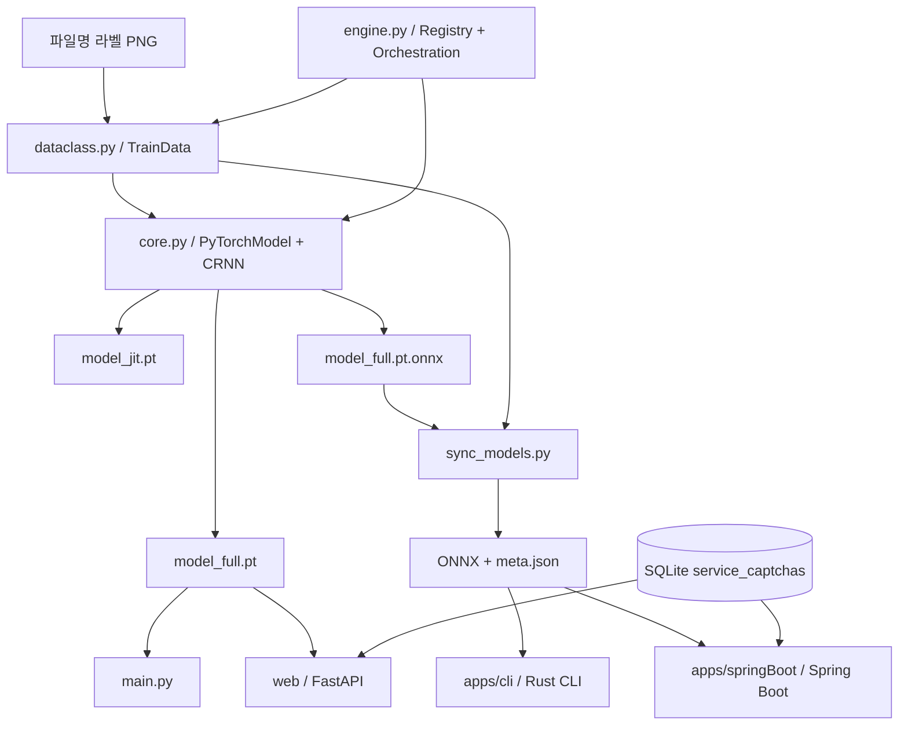
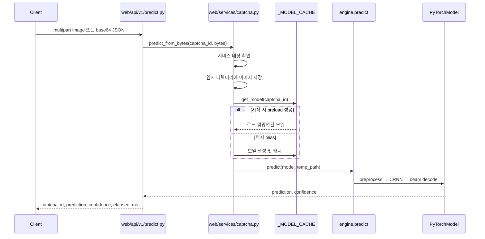

# Captcha Solver 코드베이스 분석

> 분석 기준: 2026-08-09 현재 작업 트리의 소스 코드. 이 문서는 루트 Python 구현뿐 아니라 `apps/cli`의 Rust CLI와 `apps/springBoot`의 Java 웹 서비스까지 포함한다.

## 1. 개요

이 저장소는 파일명으로 라벨링된 CAPTCHA 이미지에서 CRNN(Convolutional Recurrent Neural Network)을 학습하고, 고정 길이 CTC 디코딩으로 문자를 인식하는 다중 런타임 프로젝트다. Python 구현이 데이터 규칙·학습·PyTorch 추론·모델 내보내기의 기준이며, FastAPI가 이를 웹으로 제공한다. 같은 학습 결과를 Python 없이 배포하기 위해 ONNX 모델과 JSON 메타데이터를 경계로 Rust CLI와 Spring Boot 서버가 전처리 및 CTC 디코더를 각각 포팅해 사용한다.

주요 규모는 Python 28개, Rust 4개, Java 16개 소스 파일이다. 모델, 샘플 이미지, SQLite DB 같은 바이너리 자산도 저장소에 포함되어 있다.

## 2. 아키텍처

### 2.1 전체 구조

시스템의 중심은 루트의 평면 Python 모듈이다. `dataclass.py`가 CAPTCHA별 데이터와 경로 규칙을 정의하고, `core.py`가 모델과 학습/추론 알고리즘을 구현하며, `engine.py`가 외부 진입점을 제공한다. `main.py`와 `web/`은 이 API를 사용하는 전달 계층이다.

Rust와 Java 구현은 별도 학습 기능이 없다. Python이 만든 `model_full.pt.onnx`와 `sync_models.py`가 생성한 `.meta.json`을 받아 Python의 전처리와 디코딩 의미를 재현한다. 따라서 모델 파일만이 아니라 문자셋, 이미지 크기, 라벨 길이, threshold, 전처리 종류가 담긴 사이드카가 배포 계약의 일부다.

### 2.2 핵심 설계 특성

- 캡차 레지스트리는 `engine.get_captcha_type_list()`에 하드코딩되어 있다. 현재 `default`, `dev`, `supreme_court`, `gov24`, `wetax`, `kshop` 여섯 종류다.
- 라벨은 별도 어노테이션 파일 없이 PNG 파일명에서 얻는다. `091082.png`의 정답은 `091082`다.
- `BaseModel`이 공통 인터페이스를 정의하지만 구현은 `PyTorchModel` 하나뿐이다.
- 웹 서비스 대상은 모델 레지스트리와 별도로 SQLite `service_captchas`가 결정한다. 등록됐지만 서비스 대상이 아닐 수 있다.
- FastAPI와 Spring Boot는 시작 시 서비스 대상 모델을 메모리에 미리 올리고 워밍업한다. 누락 모델은 서버 시작을 막지 않으며 상태를 `degraded`로 만든다.
- Python은 PyTorch state dict를, Rust와 Java는 ONNX를 사용하므로 내보낸 아티팩트 정합성이 매우 중요하다.

## 3. 주요 구성요소

| 구성요소 | 파일 경로 | 책임 |
| :--- | :--- | :--- |
| `TrainData`, `CaptchaType` | `dataclass.py` | 경로 생성, 학습 이미지 감지, 문자셋/라벨 길이 결정, 이미지 전처리 |
| `BaseModel` | `base_core.py` | 모델 구현이 따라야 할 학습·저장·추론 인터페이스와 공통 속성 |
| `CRNN`, `PyTorchModel` | `core.py` | CNN-BiLSTM 모델, 데이터 로더, 학습, 체크포인트, 내보내기, 추론 |
| CTC 디코더 | `core.py` | 고정 길이 prefix beam search와 후보 사후확률 기반 confidence 계산 |
| 엔진 | `engine.py` | 캡차 레지스트리, 모델 팩토리, 학습/단건/배치 예측, 데이터 재분배 |
| Python CLI | `main.py` | 파일 기반 단건 예측, PyInstaller 경로 처리, 일반/JSON 출력 |
| FastAPI 조립 | `web/app.py` | lifespan, 정적 파일/템플릿, 시스템/API/UI 라우터 연결 |
| Python 서비스 계층 | `web/services/captcha.py` | 모델 캐시/프리로드, 서비스 ID 검증, base64/바이트 입력 처리 |
| 서비스 설정 | `web/core/db.py`, `db/schema.sql` | SQLite 초기화, 서비스 대상과 기본 캡차 조회 및 캐시 |
| REST API | `web/api/v1/predict.py` | multipart 및 JSON 예측 요청, 오류를 HTTP 상태로 매핑 |
| Rust CLI | `apps/cli/src/*.rs` | 이미지/표준입력 → 전처리 → ONNX → CTC 디코딩 → 텍스트/JSON |
| 모델 동기화 | `apps/cli/tools/sync_models.py` | Python ONNX를 portable models로 복사하고 메타데이터 생성 |
| Spring Boot 서비스 | `apps/springBoot` | ONNX 기반으로 FastAPI와 같은 UI/API/DB/상태 계약 제공 |
| 배포 | `Dockerfile`, `docker-compose.yml` | Python FastAPI 컨테이너 빌드, 모델 디렉터리 읽기 전용 마운트 |

## 4. 데이터와 제어 흐름

### 4.1 학습 흐름

1. `engine.get_captcha_model()`이 레지스트리에서 `CaptchaType`을 선택하고 `PyTorchModel`을 만든다.
2. `TrainData` 생성 시 `captcha_data/<id>/<rev>/images/train/*.png`를 스캔한다. 마지막 정렬 파일에서 이미지 크기를, 가장 긴 파일명에서 라벨 길이를, 모든 파일명에서 문자 집합을 감지한다.
3. `split_dataset()`이 동일한 `images/train` 집합을 80:20으로 나눈다. 학습 분할에는 증강을, 검증 분할에는 결정론적 전처리를 적용한다. `images/pred`는 이 분할에 참여하지 않는다.
4. 파일명의 각 문자는 1부터 시작하는 클래스 인덱스로 변환된다. 0은 CTC blank다.
5. CRNN은 그레이스케일 이미지를 CNN 특징으로 만들고 너비 방향을 시계열로 바꾼 뒤 2층 양방향 LSTM과 출력 projection을 통과시킨다.
6. `ctc` 또는 `focal` 손실로 AdamW 학습을 수행한다. CUDA에서 AMP, gradient clipping, 선형 warmup과 cosine decay를 사용한다.
7. 검증 손실이 개선될 때 `model_full.pt.tmp`에 state dict를 저장한다. 종료 후 `.tmp`를 `model_full.pt`로 승격하고 TorchScript와 ONNX도 내보낸다.

CNN의 풀링은 `(2,2) → (2,2) → (2,1)`이므로 출력은 대략 `H/8 × W/4`다. 따라서 CTC 시간축 조건은 `floor(image_width / 4) >= label_length`다. 기존 `AGENTS.md`의 `W/16` 설명은 현재 코드와 맞지 않는다.

### 4.2 Python 단건 예측 흐름

1. CLI나 웹 서비스가 `engine.predict()`를 호출한다.
2. 모델이 아직 없으면 `model_full.pt`를 읽어 CRNN에 state dict를 로드하고 eval 모드로 전환한다.
3. PIL 이미지에 CAPTCHA별 전처리와 eval transform을 적용하여 `(1, 1, H, W)` 텐서를 만든다.
4. CRNN이 `(T, 1, C)` 로짓을 출력하고 log-softmax를 적용한다.
5. 고정 길이 prefix beam search가 blank/문자 종료 확률을 합산하고 기대 길이를 채울 수 없는 prefix를 제거한다.
6. 최종 후보 중 최고 문자열을 반환한다. confidence는 살아남은 최종 후보들의 합에 대한 최고 후보의 정규화 확률이다.

### 4.3 FastAPI 요청 흐름

오류 흐름은 다음과 같다.

- 비어 있는 이미지, 잘못된 base64, 비서비스 `captcha_id`: HTTP 400.
- 이미지 디코딩, 모델 로드, 추론 중 예외: `CaptchaPredictionError`로 감싸 HTTP 500.
- 시작 시 모델 누락: preload가 건너뛰고 서버는 계속 실행하며 `/health`가 `degraded`를 반환한다.

### 4.4 Rust/Java ONNX 흐름

1. `sync_models.py`가 Python 모델 경로의 ONNX를 `apps/cli/models/<id>.onnx`로 복사한다.
2. 같은 시점의 감지 크기, 라벨 길이, 문자셋, threshold, 전처리 종류를 `<id>.meta.json`에 기록한다.
3. Rust CLI 또는 Spring Boot가 이미지와 sidecar를 읽어 Python/PIL 동작에 맞춘 전처리를 수행한다.
4. ONNX Runtime이 추론하고, 각 구현의 log-softmax 및 고정 길이 CTC beam decoder가 결과를 만든다.
5. 두 구현 모두 모델 입력 크기/클래스 수와 메타데이터가 다르면 명시적으로 실패한다.

## 5. 주요 함수와 메서드

| 함수/메서드 | 파일 | 설명 |
| :--- | :--- | :--- |
| `get_captcha_type_list()` | `engine.py` | 여섯 CAPTCHA 설정을 생성하는 단일 레지스트리 |
| `get_captcha_model()` | `engine.py` | ID를 검증하고 `PyTorchModel`을 생성 |
| `train_model()` | `engine.py` | 모델 빌드, 80/20 분할, 학습 루프 연결 |
| `predict()` | `engine.py` | 필요 시 state dict를 지연 로드하고 단건 예측 |
| `redistribute_train_pred()` | `engine.py` | 디스크의 train/pred PNG를 합치고 비율대로 이동 |
| `_detect_and_cache()` | `dataclass.py` | 학습 파일에서 크기·최대 라벨 길이·문자 집합 감지 |
| `image_pre_process()` | `dataclass.py` | 일반 또는 `supreme_court` 전처리 선택 |
| `CRNN.forward()` | `core.py` | CNN → feature projection → SpecAugment → BiLSTM → logits/CTC loss |
| `PyTorchModel.split_dataset()` | `core.py` | 파일명 라벨을 토큰화하고 train/validation loader 생성 |
| `PyTorchModel.train_model()` | `core.py` | 최적화, 검증, early stopping, 저장 및 export |
| `PyTorchModel.load_prediction_model()` | `core.py` | CRNN을 만들고 `model_full.pt` state dict 로드 |
| `ctc_beam_decode_fixed_length()` | `core.py` | 하드 길이 제약을 둔 CTC prefix beam search |
| `preload_models()` | `web/services/captcha.py` | 서비스 모델 로드와 더미 텐서 워밍업, 상태 기록 |
| `predict_from_bytes()` | `web/services/captcha.py` | 서비스 검증, 임시 파일 생성, Python 엔진 호출 |
| `get_service_config()` | `web/core/db.py` | SQLite 서비스 설정 조회 및 프로세스 캐시 |
| `run_onnx()` | `apps/cli/src/main.rs` | ONNX 세션 설정, 입력 shape 검증, 추론 |
| `preprocess()` | `apps/cli/src/preprocess.rs` | Python 전처리의 Rust 포팅 |
| `CaptchaService.predict()` | Spring `CaptchaService.java` | 모델 세션 캐시와 Java ONNX 예측 오케스트레이션 |
| `CtcDecoder.decodeFixedLength()` | Spring `CtcDecoder.java` | Python/Rust와 동등한 Java beam decoder |

## 6. 설정과 환경

### 6.1 Python/FastAPI

| 설정 | 출처/기본값 | 목적 |
| :--- | :--- | :--- |
| Python | `pyproject.toml`: `==3.12.*` | 실행 버전 고정 |
| 패키지 관리자 | `uv.lock`, `uv` | 의존성 재현 |
| `DEFAULT_CAPTCHA_ID` | `.env`, `supreme_court` | DB 설정이 없을 때만 기본 ID 폴백 |
| `WEB_HOST` | `0.0.0.0` | 직접 실행 Uvicorn 바인드 주소 |
| `WEB_PORT` | `5000` | 직접 실행 Uvicorn 포트 |
| `WEB_DEBUG` | `false` | 직접 실행 reload |
| `APP_TITLE` | `Captcha Solver` | FastAPI 제목 |
| `DB_PATH` | `./db/captchaSolver.sqlite3` | 서비스 설정 SQLite 파일 |
| `DB_SCHEMA_PATH` | `./db/schema.sql` | 시작 시 적용할 스키마 |
| 서비스 대상 | `service_captchas` | enabled/default/sort order 결정 |
| 모델/데이터 경로 | `captcha_data/<id>/<rev>` | 이미지와 PyTorch/JIT/ONNX 아티팩트 |

`DB_DRIVER`와 `DATABASE_URL` 설정 필드는 존재하지만 현재 Python DB 계층은 stdlib `sqlite3`와 `DB_PATH`만 사용한다. `.env.example`은 `DB_URL`을 제시하지만 `Settings` 필드명은 `database_url`이므로 이 예시는 실제 해당 필드를 덮어쓰지 않는다.

### 6.2 Rust CLI

| 옵션 | 기본값 | 목적 |
| :--- | :--- | :--- |
| `--captcha-id` | `supreme_court` | `<id>.onnx`/sidecar 선택 |
| `--image` | 필수 | 파일 경로 또는 `-`(stdin) |
| `--models-dir` | 실행 파일 옆 `models/` | 모델 디렉터리 |
| `--model`, `--meta` | 자동 추론 | 아티팩트 직접 지정 |
| `--beam-width` | 10 | CTC beam 수 |
| `--threads` | 1 | ONNX Runtime intra-op thread 수 |
| `--json` | false | 구조화 응답 출력 |

### 6.3 Spring Boot

Spring Boot 4.1.0, Java 25, ONNX Runtime 1.23.0을 사용한다. 기본 서버 포트는 5000이며 `captcha.models-dir`, `captcha.db-path`, `captcha.schema-path`, `captcha.default-captcha-id`, `captcha.beam-width`, `captcha.intra-op-threads`로 주요 경로와 추론 설정을 바꾼다. API JSON은 FastAPI와 맞추기 위해 snake_case를 사용한다.

## 7. 주의점, 함정, 중요 결함

### 7.1 최적 PyTorch 가중치와 JIT/ONNX가 달라질 수 있음

검증 최적 state dict는 `.tmp` 파일에 저장되고 학습 종료 후 `model_full.pt`로 이름만 바뀐다. 그러나 export 전에 이 파일을 메모리 모델로 다시 로드하지 않는다. 따라서 `.pt`는 최적 에폭인데 JIT/ONNX는 마지막 에폭일 수 있다. `apps/cli/README.md`에는 실제 `kshop`에서 두 아티팩트의 예측이 달랐다는 조사 결과가 기록되어 있다.

권장 수정은 `.tmp` 승격 직후 `load_state_dict()`로 최적 가중치를 다시 로드하고 그 단일 상태에서 PT/JIT/ONNX를 생성하는 것이다. 이 결함을 고치기 전에는 Python과 portable 런타임의 결과 차이를 전처리 포팅 문제로 단정하면 안 된다.

### 7.2 감지 설정과 모델 생성 설정이 혼용됨

전처리와 sidecar 생성은 `detected_image_width`, `detected_label_length` 등을 사용하지만 `build_model()`은 생성자 원본 필드인 `image_width`, `label_length`를 사용한다. 학습 이미지 크기가 기본값과 다르면 PyTorch CNN은 일부 폭 변화에 동작해도 fixed-shape ONNX와 sidecar가 충돌한다. 현재 `dev` 모델의 200px ONNX와 250px 메타데이터 불일치가 알려진 사례다.

### 7.3 제공된 운영 문서 일부가 현재 코드와 다름

- 실제 시간축 축소는 `W/4`이며 `W/16`이 아니다.
- 실제 학습 증강은 회전 ±5°, 이동 5%, perspective, 강화된 jitter/erasing을 포함한다.
- 저장소는 더 이상 “루트 평면 Python만”이 아니라 Rust/Java 애플리케이션을 포함한다.
- 테스트가 전혀 없는 것이 아니라 Python CTC 자체 점검, Rust 단위 테스트, Spring 컨텍스트/CTC/OpenAPI 테스트가 있다. 다만 Python 학습·웹 통합 테스트는 부족하다.

### 7.4 데이터와 라벨 경계 조건

- 감지 라벨 길이는 가장 긴 파일명이다. 길이가 다른 파일은 `get_data_files()`에서 조용히 제외된다.
- 문자셋에 없는 문자는 학습 토큰화에서 조용히 생략되지만 CTC target length는 고정 라벨 길이를 사용한다. 설정이 어긋나면 shape/loss 오류나 잘못된 학습으로 이어질 수 있다.
- 학습 파일이 없거나 분할하기에 너무 적으면 `train_test_split()`에서 실패한다. 사전 검증과 친절한 도메인 오류가 없다.
- 이미지 크기는 정렬상 마지막 PNG 하나에서만 감지하므로 데이터셋 내부 크기 불일치를 잡지 못한다.

### 7.5 파일 재분배는 파괴적이며 중복 처리에 결함이 있음

`redistribute_train_pred()`와 `shuffle_train_data()`는 실제 파일을 이동한다. 특히 전자는 pred 파일과 같은 train 대상이 있으면 train 파일을 삭제하지만 해당 분기에서 pred 파일을 train으로 이동하지 않는다. 결과적으로 중복 파일이 pred에 남을 수 있고 반환 통계도 실제 최종 상태와 다를 수 있다. 실행 전 백업 또는 버전 관리 확인이 필요하다.

### 7.6 런타임 상태와 동시성

- `core.py` import만으로 CUDA/cuDNN probe와 전역 backend 설정 변경이 발생한다.
- FastAPI 모델 캐시와 DB 설정 캐시는 프로세스 로컬이다. 멀티 워커는 모델/GPU 메모리를 워커 수만큼 복제하고 서로 다른 시점의 설정을 볼 수 있다.
- FastAPI 캐시는 명시적 lock이 없어 동시 lazy miss에서 중복 모델 생성 가능성이 있다. 정상 startup preload가 위험을 줄이지만 제거하지는 않는다.
- DB나 ONNX를 바꿔도 이미 로드된 서비스에는 자동 반영되지 않는다. 재시작 또는 명시적 reload 기능이 필요하다.
- `decode_image_data()`는 base64 형식만 검사한다. 실제 이미지 여부와 크기 제한은 뒤 단계에 맡긴다. FastAPI JSON 요청에는 애플리케이션 수준 크기 제한이 없다.

### 7.7 문서와 구현의 기타 불일치

`docs/crnn_ctc.md`에는 residual connection, ReduceLROnPlateau, length bonus 등 현재 구현과 맞지 않거나 더 이상 사용되지 않는 설명이 남아 있다. 모델 변경 시 코드와 이 문서를 함께 갱신하는 절차가 필요하다.

## 8. 확장 지점

### 새 CAPTCHA 유형 추가

1. `captcha_data/<id>/<rev>/images/train`에 파일명 라벨 PNG를 넣는다.
2. `engine.get_captcha_type_list()`에 `CaptchaType`을 등록한다.
3. 특수 전처리가 필요하면 `TrainData.image_pre_process()` 분기를 추가한다.
4. 학습 후 PT/JIT/ONNX 정합성을 검증한다.
5. `sync_models.py <id>`로 ONNX와 sidecar를 갱신한다.
6. Rust와 Java가 새 전처리 이름을 이해하도록 양쪽 구현을 확장하고 parity 테스트를 추가한다.
7. 웹 서비스 대상이면 `service_captchas`에 행을 추가하고 서버를 재시작한다.

### 새 모델 백엔드 추가

`BaseModel`을 구현하고 `engine.get_captcha_model()`의 팩토리를 확장할 수 있다. 현재 `engine.py`와 여러 호출부가 `PyTorchModel` 구체 타입과 `.model`, `.device`, `.load_prediction_model()`에 의존하므로 완전한 다형성을 원하면 먼저 엔진/서비스가 추상 인터페이스만 사용하도록 경계를 정리해야 한다.

### API 확장

Python은 `web/api/v1` 라우터와 `web/schemas`, Java는 controller/record/OpenAPI 테스트를 함께 변경해야 한다. 두 서버의 호환성이 목표이므로 경로, snake_case 필드, 오류의 `{"detail": ...}` 형태를 계약 테스트로 고정하는 편이 안전하다.

### 모델 배포 개선

- ONNX 안에 메타데이터를 포함하거나 모델+sidecar에 버전/해시 manifest를 추가한다.
- sync 단계에서 shape, 클래스 수, 샘플 예측을 검증하고 불일치 시 복사를 실패시킨다.
- Python/Rust/Java 공통 golden image 세트를 CI에서 실행한다.
- 최적 체크포인트를 다시 로드한 뒤 모든 형식을 한 트랜잭션처럼 내보낸다.

## 9. 실행 및 검증 지도

| 목적 | 명령 |
| :--- | :--- |
| Python 의존성 설치 | `uv sync` |
| FastAPI 개발 서버 | `uv run fastapi dev web/app.py --host 0.0.0.0 --port 8000` |
| Python CLI | `uv run python main.py -c supreme_court -i <image>` |
| 학습 | `train.py` 상단 설정 후 `uv run python train.py` |
| Python CTC 점검 | `uv run python test_ctc_decode.py` |
| Rust 테스트 | `cd apps/cli && cargo test` |
| Rust/Python 비교 | `uv run python apps/cli/tools/compare_with_python.py --limit 100` |
| Spring 테스트 | `cd apps/springBoot && ./mvnw test` (Windows: `mvnw.cmd test`) |
| Docker 웹 서비스 | `docker compose up --build` |

## 10. 우선순위 권고

1. 최적 체크포인트를 메모리에 다시 로드한 뒤 PT/JIT/ONNX를 동일 상태에서 생성하도록 수정한다.
2. 모델 생성과 전처리 모두 감지값 또는 명시 설정 중 하나를 일관되게 사용하고, 학습 전에 전체 데이터 크기/라벨/문자셋을 검증한다.
3. 세 런타임의 golden parity 테스트를 자동화하고 모델+메타데이터 버전/해시를 검증한다.
4. 파괴적 데이터 재분배의 중복 처리와 통계를 고치고 dry-run을 제공한다.
5. `README.md`, `docs/crnn_ctc.md`, `AGENTS.md`의 아키텍처·증강·CTC 제약 설명을 현재 코드에 맞춘다.

이 순서는 먼저 모델 아티팩트의 의미를 안정화하고, 다음으로 입력 계약과 다중 런타임 동등성을 고정한 뒤 운영·문서 품질을 개선하도록 잡은 것이다.
