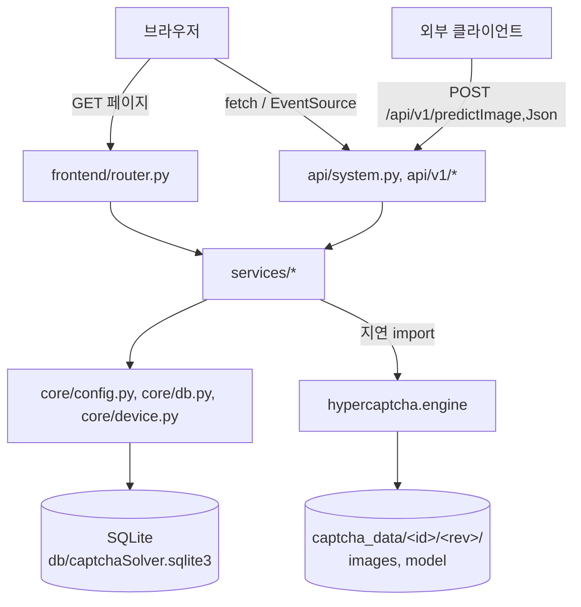
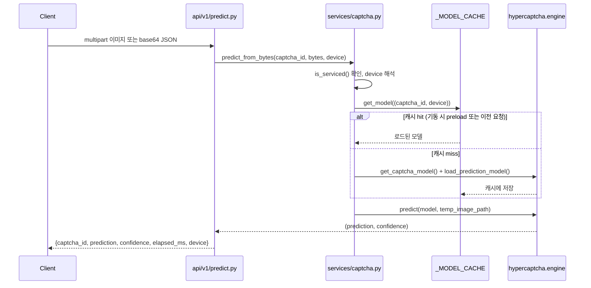
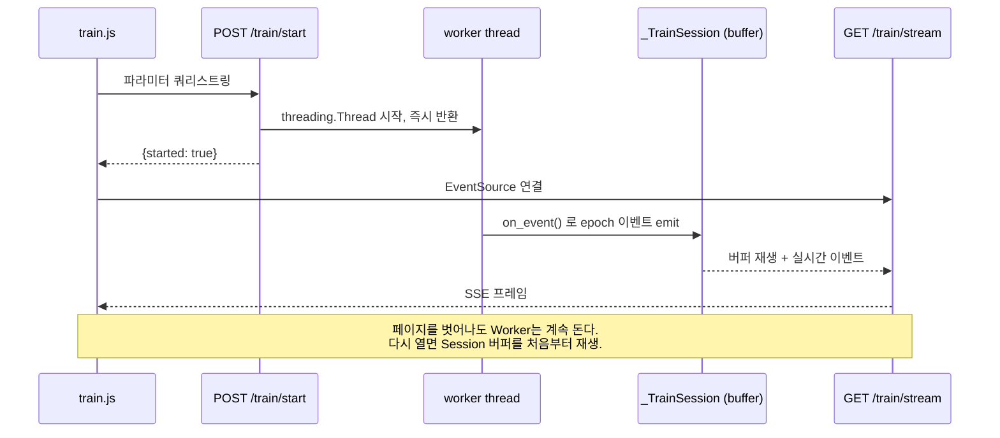

# apps/web 아키텍처

> 대상: `apps/web` (FastAPI 웹 애플리케이션) 하나에 집중한 문서다. 저장소 전체(Rust CLI, Spring Boot 포함) 개요는 [codebase-analysis.md](./codebase-analysis.md), 빠른 실행 명령은 [AGENTS.md](../AGENTS.md)를 참고한다.

## 1. 개요

`apps/web`은 `hypercaptcha` 라이브러리(`packages/python_3.12/hyperCaptcha`)를 소비하는 FastAPI 애플리케이션이다. 두 가지 역할을 동시에 한다.

1. **추론 API 서버** — 외부 클라이언트가 이미지를 보내 캡차 문자열을 받는다 (`/api/v1/predictImage`, `/api/v1/predictJson`).
2. **운영/실험용 관리 UI** — 브라우저에서 모델 상태 확인, 일괄 추론 검증, 데이터 수집, 학습을 수행한다 (`/`, `/predict`, `/train`, `/data-source`, `/status`).

Python 패키지 이름은 `web`이지만 디스크 경로는 `apps/web`이다 (`pyproject.toml`의 `[tool.setuptools.package-dir] web = "apps/web"`). import 문에는 항상 `web.*`을 쓴다.

## 2. 디렉터리 구조

```
apps/web/
├── app.py                 # FastAPI 앱 조립 (lifespan, root_path/PrependRootPath, 라우터, static/templates 마운트)
├── server.sh / server.ps1 # 개발서버 프로세스 관리 (start/stop/restart/status/logs)
├── core/
│   ├── config.py           # pydantic-settings 기반 Settings (.env 로드)
│   ├── db.py                # SQLite 접근 계층 (서비스 설정, 학습 파라미터 영속화)
│   ├── device.py            # cpu/cuda/auto 디바이스 판정
│   └── version.py           # 표시용 앱 버전 (.env → pyproject.toml → 패키지 메타데이터 순 폴백)
├── api/
│   ├── system.py            # /health, /ping, /version
│   └── v1/
│       ├── router.py         # api_v1_router 조립
│       ├── predict.py        # 단건 추론
│       ├── batch.py          # 일괄 추론 (SSE)
│       ├── train.py          # 학습 (SSE)
│       └── data_source.py    # 데이터 수집 (SSE)
├── services/                # FastAPI 를 모르는 순수 파이썬 비즈니스 로직
│   ├── captcha.py            # 모델 캐시, 단건 예측
│   ├── batch_predict.py      # 일괄 추론 오케스트레이션
│   ├── data_source.py        # 웹 스크래핑 기반 이미지 수집
│   └── train.py              # 백그라운드 학습 세션 관리
├── schemas/predict.py        # Pydantic 요청/응답 모델
├── frontend/router.py        # HTML 페이지 라우터 (Jinja2 렌더링)
├── templates/                # Jinja2 템플릿 (base.html + 페이지별)
└── static/                   # JS, favicon, Tailwind 브라우저 빌드
```

## 3. 레이어드 구조



- **`api/`, `frontend/`** — FastAPI 라우터. HTTP 계약(상태 코드, 응답 스키마)을 다루고 실제 로직은 `services/`에 위임한다.
- **`services/`** — FastAPI 의존성이 없는 순수 파이썬. 함수는 평범한 값이나 dict-yield 제너레이터를 돌려주므로 서버 없이 REPL/테스트에서 그대로 호출해 확인할 수 있다. `hypercaptcha`와 `torch` import는 **함수 안에서 지연 실행**한다 — 모듈 최상위에서 import하면 서버 기동 시점에 CUDA 초기화가 딸려와 느려진다 (`core/device.py`, `services/captcha.py` 주석 참고).
- **`core/`** — 설정, DB, 디바이스 판정, 버전 조회처럼 여러 서비스가 공유하는 낮은 층.
- **`hypercaptcha`** — 학습/추론 엔진 (별도 워크스페이스 패키지). `apps/web`은 이 라이브러리의 소비자일 뿐 알고리즘을 갖지 않는다.

## 4. 요청 흐름

### 4.1 단건 추론 (`POST /api/v1/predictImage`, `/predictJson`)



오류 매핑: 빈 이미지·잘못된 base64·비서비스 `captcha_id`·잘못된 `device` → `ValueError` → HTTP 400. 이미지 디코딩/모델 로드/추론 중 예외 → `CaptchaPredictionError` → HTTP 500.

### 4.2 백그라운드 작업 + SSE (일괄 추론 / 학습 / 데이터 수집)

세 기능(`batch.py`, `train.py`, `data_source.py`)은 같은 패턴을 공유한다.

1. **전역 `threading.Lock`으로 동시 실행 1개 제한** — 서버 전체에서 배치/학습/수집을 각각 하나씩만 허용한다 (셋은 서로 다른 락이라 세 종류는 동시에 돌 수 있다).
2. **작업은 동기 제너레이터** — `run()`은 `dict`를 `yield`하는 일반 함수다. `async def`가 아닌 이유는 추론/학습이 CPU를 오래 붙잡는 동기 작업이라, async 제너레이터로 두면 이벤트 루프 전체가 멈추기 때문이다. Starlette가 동기 제너레이터를 스레드풀에서 대신 실행해 준다.
3. **API 라우터는 그 이벤트를 SSE(`text/event-stream`)로 감싼다** — `event: <type>\ndata: <json>\n\n` 형식. `EventSource`는 GET만 지원하므로 스트림 엔드포인트는 전부 GET이다.
4. **시작 전 검증은 스트림을 열기 전에 한다** — 스트림이 한번 열리면 HTTP 상태 코드를 바꿀 수 없으므로, 검증 실패는 400/409로 먼저 응답하고 그 외 실행 중 오류만 `event: error`로 스트림에 흘린다.

**학습(`train.py`)만 다른 점**: `engine.train_model()`은 제너레이터가 아니라 끝까지 도는 동기 호출이다. 그래서 학습은 워커 스레드(`threading.Thread`)에서 돌리고, `on_event` 콜백이 이벤트를 `_TrainSession` 버퍼에 쌓는다. SSE 스트림은 이 세션에 "구독"만 한다 — 페이지를 떠나도 학습은 계속되고, `/train`을 다시 열면 세션 버퍼를 처음부터 재생해 이어보기가 된다. 이 분리 때문에 `POST /train/start`는 즉시 반환하고, 진행 상황은 별도의 `GET /train/stream`으로 본다.



## 5. 모델 캐시와 디바이스

- `services/captcha.py`의 `_MODEL_CACHE`는 `(captcha_id, device)` 튜플을 키로 쓴다. 모델 인스턴스는 특정 디바이스에 가중치가 올라간 상태라, 같은 캡차라도 CPU/CUDA는 별도 인스턴스가 필요하다. **`captcha_id`만으로 캐시를 조회하는 코드를 새로 추가하지 말 것.**
- 로드 실패한 인스턴스는 캐시에 남기지 않는다 — "캐시에 있으면 즉시 쓸 수 있는 모델"이라는 불변식을 지키기 위해서다 (과거에는 로드 실패 후에도 껍데기가 캐시에 남아 무학습 모델이 조용히 서빙된 버그가 있었다. `25426cb3` 참고).
- 기동 시 `app.py`의 `lifespan`이 `preload_models()`를 호출해 서비스 대상 캡차를 전부 로드하고 더미 텐서로 워밍업한다. 학습된 모델이 없는 캡차는 건너뛰며(기동 실패 아님), `/health`가 `degraded`를 반환한다.
- 디바이스 판정은 `core/device.py` 한 곳에서만 한다: `auto`(기본, CUDA 가용 시 CUDA) / `cpu` / `cuda`. 쓸 수 없는 디바이스를 요청하면 `ValueError` → HTTP 400.

## 6. SQLite 계층 (`core/db.py`)

- `init_db()`가 기동 시 `db/schema.sql`과 `db/seed_captcha_types.sql`을 순서대로 적용한다. 둘 다 `IF NOT EXISTS`/`INSERT OR IGNORE`라 반복 실행해도 안전하다. `_add_missing_columns()`는 SQLite에 없는 `ADD COLUMN IF NOT EXISTS`를 흉내 내는 보정 단계다.
- **서비스 대상 설정** (`service_captchas` 테이블) — 어떤 캡차를 실제로 서비스할지, 기본 캡차가 무엇인지 결정한다. 환경 변수가 아니라 DB가 우선이다. 프로세스 캐시(`_SERVICE_CONFIG`)에 담기며, `get_service_config(reload=True)`로만 다시 읽는다.
- **학습 파라미터 영속화** (`train_run_params` 테이블) — Training 페이지에서 (캡차, 리비전)별로 마지막에 쓴 파라미터를 기억해 폼을 다시 채운다.
- **학습 설정 스냅샷** (`train_data_configs` 테이블) — 학습 시작 시점에 감지된 문자셋/이미지 크기 등을 기록한다 (참고용, 추론 계약 자체는 모델 sidecar `meta.json`이 담당).

## 7. 동시성과 프로세스 로컬 상태 (알아둘 것)

- 모델 캐시, 서비스 설정 캐시, 학습 세션은 전부 **프로세스 로컬**이다. `uvicorn --workers N`으로 멀티 워커를 띄우면 모델을 워커 수만큼 중복 로드하고, 워커마다 다른 시점의 DB 설정을 볼 수 있다. 현재 배포는 단일 워커를 전제한다.
- DB나 모델 파일을 바꿔도 이미 로드된 서비스에는 자동 반영되지 않는다 — 재시작이 필요하다.
- 배치 추론/학습/데이터 수집은 각각 독립된 `threading.Lock`이라 서로 다른 세 종류는 동시에 실행 가능하지만, 같은 종류는 하나만 허용된다 (`409 Conflict`).
- `services/data_source.py`는 운영자가 입력한 URL을 서버가 대신 요청한다(SSRF 형태). 의도적으로 사설/루프백 대역을 막지 않는다 — 주 용도가 LAN 내부 장비(예: ipTIME 공유기)에서 캡차를 가져오는 것이기 때문이다. 대신 응답 크기 상한(8MB)만 두므로, **이 서비스에는 인증이 없다는 점을 배포 시 반드시 방화벽/리버스 프록시로 보완해야 한다** (기본 `WEB_HOST=0.0.0.0`).

## 8. 리버스 프록시 하위 경로 (`WEB_CONTEXT_PATH`)

앱을 도메인 루트가 아니라 프록시 하위 경로(예: `/captcha`)에 물릴 때 쓰는 설정이다. `Settings.web_context_path`가 어떤 형태로 넣어도(`captcha`, `/captcha`, `/captcha/`) `/captcha`로 정규화하며, `create_app()`이 이 값으로 다음 세 가지를 동시에 처리한다.

1. **`FastAPI(root_path=...)`** — 라우트 자체는 접두사 없는 요청도 정상 매칭하고, `/docs`의 `openapi.json`에 `servers: [{"url": "/captcha"}]`가 실려 Swagger가 올바른 하위 경로로 API를 호출한다.
2. **`PrependRootPath` ASGI 미들웨어** — `root_path`만으로는 부족한 지점을 메꾼다. `StaticFiles`로 마운트한 `/static`은 하위 `root_path`를 스스로 못 잘라내 프록시가 접두사를 그대로 넘기면(`/captcha/static/...`) 404가 난다. 이 미들웨어가 들어온 `scope["path"]`에 접두사가 없으면 붙여준다 — **결과적으로 프록시가 접두사를 떼고 넘기든(`/health`) 안 떼고 넘기든(`/captcha/health`) 같은 라우트로 도달한다.**
3. **템플릿·정적 JS 링크 접두사** — 템플릿의 `href`/`src`/`action`은 절대 경로(`/static/...`)라 `root_path`가 자동으로 붙지 않는다. `templates.env.globals["context_path"]`로 모든 템플릿에 값을 넘기고, `base.html`이 이를 `<html data-context-path="...">`로 다시 내려 정적 JS(`train.js`, `predict.js`, `data_source.js`)가 `document.documentElement.dataset.contextPath`로 읽어 `fetch`/`EventSource` URL 앞에 붙인다.

기본값(빈 문자열)은 이 세 처리가 전부 no-op이 되어 기존 루트 배포와 동일하게 동작한다. 검증은 `tests/test_context_path.py` — 프록시가 접두사를 떼는 경우와 안 떼는 경우 양쪽에서 라우트/정적 파일/Swagger가 모두 살아있는지 확인한다. 설정 방법과 프런트엔드 쪽 상세 패턴은 [web-dev-guide.md §8](./web-dev-guide.md#8-리버스-프록시-하위-경로-배포-web_context_path), [web-frontend-guide.md §9](./web-frontend-guide.md#9-리버스-프록시-하위-경로-context_path) 참고.

## 9. 관련 문서

- [web-api-reference.md](./web-api-reference.md) — 엔드포인트별 요청/응답/이벤트 상세
- [web-frontend-guide.md](./web-frontend-guide.md) — 템플릿/정적 자산/SSE 클라이언트 패턴
- [web-dev-guide.md](./web-dev-guide.md) — 로컬 개발 환경, 테스트, 확장 절차
