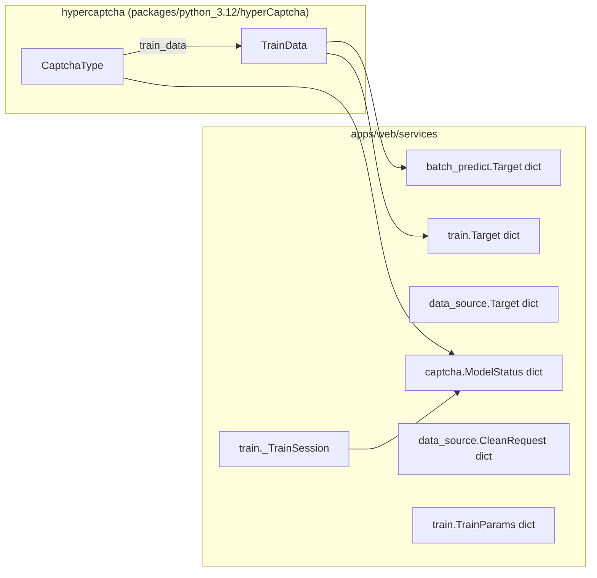
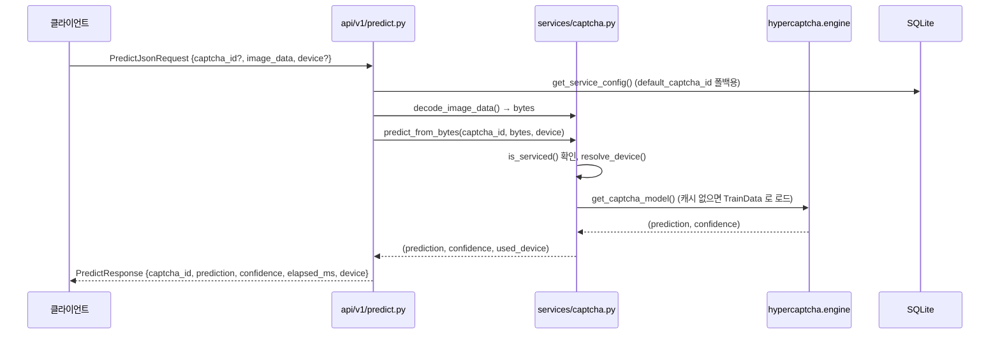
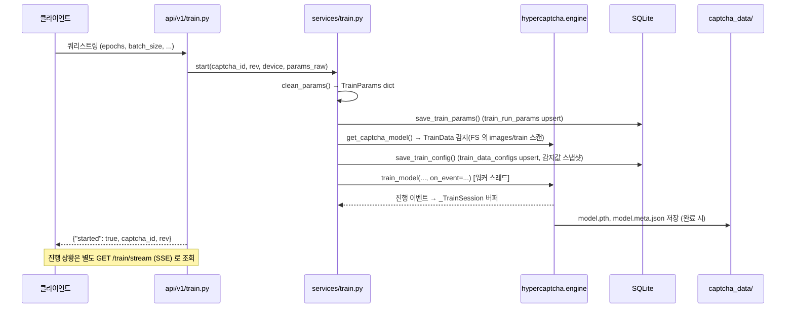

# apps/web 데이터 모델

> 대상: `apps/web`을 **데이터 관점**(도메인 객체 / DTO / 엔티티)에서 정리한 문서다. 레이어 구조와 요청 흐름은 [web-architecture.md](./web-architecture.md), 엔드포인트별 요청/응답 명세는 [web-api-reference.md](./web-api-reference.md)를 참고한다. 이 문서는 그 둘을 보완하는 자료로, 엔드포인트를 다시 나열하지 않고 **어떤 데이터가 어떤 형태로 오가는지**에 집중한다.

## 1. 데이터 계층 개요

`apps/web`의 데이터는 세 갈래로 나뉜다.

| 계층 | 저장/전달 형태 | 위치 |
|---|---|---|
| **DTO** (요청/응답) | Pydantic `BaseModel` (일부는 평범한 `dict`/쿼리스트링) | `schemas/predict.py`, `api/v1/*.py` |
| **도메인 객체** (서비스 내부) | `dict`, `dataclass` 없이 대부분 plain `dict` + `hypercaptcha` 의 Pydantic 모델(`CaptchaType`, `TrainData`) | `services/*.py`, `hypercaptcha.dataclass` |
| **엔티티** (영속 데이터) | SQLite 테이블 + 파일시스템(PNG 이미지, `model.pth`, `meta.json`) | `core/db.py`, `db/schema.sql`, `captcha_data/` |

ORM은 쓰지 않는다. `core/db.py`는 `sqlite3` 표준 라이브러리를 SQL 문 그대로 사용하는 얇은 접근 계층이고, 스키마는 코드가 아니라 `db/schema.sql` + `db/seed_captcha_types.sql`이 정의한다(`init_db()`가 기동 시 순서대로 실행). 영속 데이터의 상당 부분(학습/검증 이미지, 학습된 모델 가중치)은 DB가 아니라 `captcha_data/<captcha_id>/<rev>/` 아래 파일시스템에 있다 — DB는 "그 파일들을 어떻게 다룰지"에 대한 설정/이력만 들고 있다.

## 2. 엔티티 (SQLite, `db/schema.sql`)

DB 파일 경로는 `Settings.db_path` (기본 `./db/captchaSolver.sqlite3`, 저장소 루트 기준). `PRAGMA foreign_keys = ON`이 켜져 있어 FK 제약이 실제로 강제된다.

### 2.1 `captcha_types`

캡차 종류의 표시용 메타데이터. `captcha_id`는 `hypercaptcha.engine.get_captcha_type_list()`가 코드로 등록한 캡차 ID와 일치해야 의미가 있다(DB가 등록 자체를 강제하지는 않음).

| 컬럼 | 타입 | 제약 | 설명 |
|---|---|---|---|
| `captcha_id` | TEXT | PK | 캡차 종류 식별자 (예: `supreme_court`, `gov24`) |
| `name` | TEXT | NOT NULL, DEFAULT '' | 표시용 이름 |
| `description` | TEXT | NOT NULL, DEFAULT '' | 설명 |
| `seq` | INTEGER | NOT NULL, DEFAULT 0 | 화면 표시 순서(작을수록 먼저). 시드: supreme_court 1, gov24 2, wetax 3, iptime 4 (마이그레이션 10; 기존 DB 는 `_add_missing_columns()`가 컬럼을 붙이고 시드 UPDATE 가 값을 채움) |
| `created_at` / `updated_at` | TEXT | NOT NULL, DEFAULT CURRENT_TIMESTAMP | |

모든 캡차 목록(Home·Predict·Training·Data Source 셀렉트, Status 페이지, 세 서비스의 `list_targets()`)은 `services/captcha.ordered_captcha_ids()` 한 곳을 거쳐 `seq` 순으로 정렬된다. DB 에 없는 ID 는 뒤로 가되 레지스트리 순서를 유지한다. `service_captchas.sort_order`는 서비스 대상 목록의 순서이고, 화면 순서의 진실 소스는 `captcha_types.seq`다.

### 2.2 `train_data_configs`

캡차·백엔드·리비전별 학습/전처리 설정. `apps/web`에서 유일하게 UPDATE까지 되는 핵심 설정 테이블이다.

| 컬럼 | 타입 | 제약 | 설명 |
|---|---|---|---|
| `id` | INTEGER | PK AUTOINCREMENT | |
| `captcha_id` | TEXT | NOT NULL, FK → `captcha_types.captcha_id` ON DELETE CASCADE | |
| `backend` | TEXT | NOT NULL, DEFAULT `'pytorch'` | |
| `rev` | INTEGER | NOT NULL, DEFAULT 1 | 같은 캡차의 데이터/모델 세대 구분자. **1부터 시작** |
| `train_data_base_dir` | TEXT | NOT NULL, DEFAULT `'./captcha_data'` | 이미지·모델 파일시스템 루트 |
| `image_width` / `image_height` | INTEGER | NOT NULL, CHECK > 0 | **크롭 전** 원본 크기 (crop 좌표계의 기준) |
| `label_length` | INTEGER | NOT NULL, CHECK > 0 | 캡차 정답 문자열 길이 |
| `characters` | TEXT | NOT NULL, DEFAULT '' | 선언 문자 집합. 빈 문자열이면 `images/train` 파일명에서 자동 감지 |
| `threshold` | INTEGER | NOT NULL, DEFAULT 255, CHECK 0~255 | 이진화 임계값 |
| `preprocess` | TEXT | NOT NULL, DEFAULT `'default'` | 전처리 종류 (`default`\|`supreme_court`\|`iptime`) |
| `crop` | TEXT | NULL 허용 | JSON 배열 `[left, top, right, bottom]` (PIL 규약). NULL이면 크롭 없음 |
| `created_at` / `updated_at` | TEXT | NOT NULL, DEFAULT CURRENT_TIMESTAMP | |

제약: `UNIQUE (captcha_id, backend, rev)`. 인덱스: `idx_train_data_configs_captcha_id`.

이 테이블은 `core/db.py`의 `save_train_config()`가 **학습을 시작할 때마다** upsert한다(라벨을 고치면 감지되는 문자셋이 바뀌기 때문에, 그 시점의 실측값으로 갱신). `characters`/`preprocess`/`crop` 세 컬럼은 초기 스키마에 없었고 `_add_missing_columns()`가 기동 시 `ALTER TABLE`로 보정한다(SQLite에 `ADD COLUMN IF NOT EXISTS`가 없어서).

### 2.3 `service_captchas`

어떤 캡차를 실제로 서비스(추론 응대)할지, 그중 기본값이 무엇인지.

| 컬럼 | 타입 | 제약 | 설명 |
|---|---|---|---|
| `captcha_id` | TEXT | PK | |
| `enabled` | INTEGER | NOT NULL, DEFAULT 1, CHECK IN (0,1) | 서비스 대상 여부 |
| `is_default` | INTEGER | NOT NULL, DEFAULT 0, CHECK IN (0,1) | 기본 캡차 여부 |
| `sort_order` | INTEGER | NOT NULL, DEFAULT 0 | 표시 순서 |
| `created_at` / `updated_at` | TEXT | NOT NULL, DEFAULT CURRENT_TIMESTAMP | |

부분 유니크 인덱스 `idx_service_captchas_default`가 `is_default = 1`인 행을 최대 1개로 강제한다(기본 캡차는 하나뿐).

`core/db.get_service_config()`가 이 테이블을 읽어 `{"default_captcha_id", "serviced": [...], "source": "db"}`를 만든다. 테이블이 비어 있거나 조회에 실패하면 `.env`(`Settings.default_captcha_id`) 폴백으로 `source: "fallback"`을 돌려준다 — DB 장애가 서비스 전체를 막지 않기 위한 설계.

### 2.4 `train_run_params`

Training 페이지에서 (캡차, 리비전)별로 마지막에 쓴 학습 파라미터(사용자 UI 편의값). 코어 설정이 아니라서 컬럼 대신 JSON 문자열로 통째로 저장한다.

| 컬럼 | 타입 | 제약 | 설명 |
|---|---|---|---|
| `captcha_id` | TEXT | PK(복합), FK → `captcha_types.captcha_id` ON DELETE CASCADE | |
| `rev` | INTEGER | PK(복합), NOT NULL, DEFAULT 1 | |
| `params` | TEXT | NOT NULL, DEFAULT `'{}'` | JSON. §4.4 `TrainParams`의 키 부분집합(`shuffle` 제외) |
| `updated_at` | TEXT | NOT NULL, DEFAULT CURRENT_TIMESTAMP | |

### 2.5 `data_source_params`

Data Source 페이지에서 (캡차, 리비전)별로 마지막에 쓴 수집 입력값. `train_run_params`와 같은 이유로 JSON 한 컬럼이며 구조도 같다. 마이그레이션 9.

| 컬럼 | 타입 | 제약 | 설명 |
|---|---|---|---|
| `captcha_id` | TEXT | PK(복합), FK → `captcha_types.captcha_id` ON DELETE CASCADE | |
| `rev` | INTEGER | PK(복합), NOT NULL, DEFAULT 1 | |
| `params` | TEXT | NOT NULL, DEFAULT `'{}'` | JSON `{url, content_type, selector, count, delay_ms}` (§4.6 `PERSIST_PARAMS`) |
| `updated_at` | TEXT | NOT NULL, DEFAULT CURRENT_TIMESTAMP | |

폼 편집 시 `POST /data-source/params`가, 수집 실행 시 `run()`이 각각 upsert한다.

### 2.6 스키마에는 있지만 코드가 읽지 않는 테이블

아래 세 테이블은 `db/schema.sql`에 정의·시드되어 있으나, `apps/web`과 `hypercaptcha` 어디에도 이 테이블을 `SELECT`하는 코드가 없다(예약된 구조 또는 향후 확장용으로 보인다). 문서 정확성을 위해 명시해 둔다.

- **`train_data_characters`** — `train_data_configs.characters`를 문자 단위로 쪼갠 표현(문자별 정렬 순서). `schema.sql` 주석대로 "보통은 시드할 필요가 없다."
- **`train_info_cache`** — 캡차별 자동 감지 결과(이미지 크기/라벨 길이/문자셋)를 캐시하기 위한 테이블. 실제 감지 캐시는 DB가 아니라 `hypercaptcha.dataclass.TrainData._train_info` (런타임 메모리)가 담당한다.
- **`character_sets`** — 이름 붙은 문자 집합 상수(`DIGITS`, `ALPHA_NUMERIC` 등)의 참고용 사전 데이터.

### 2.7 `schema_migrations`

`version`(PK) / `name` / `applied_at`. 실제 마이그레이션 러너는 없고, 각 `ALTER`/`CREATE` 블록이 자신을 기록하는 이력용 로그다. 시드 파일의 마이그레이션 8(`rev_starts_at_1_drop_kshop`)은 기존 DB 의 rev 0 행을 `UPDATE OR IGNORE` 로 rev 1 로 옮기고 제거된 캡차 행을 지우는 멱등 블록이다 — 리비전이 0 부터 시작하던 시절의 DB 를 자동 보정한다.

### 2.8 파일시스템 엔티티 (`captcha_data/<captcha_id>/<rev>/`)

DB 테이블은 아니지만 영속 데이터라는 점에서 엔티티에 준한다. 실제 학습 이미지·모델 파일의 진실 소스는 파일시스템이며, `services/train.py`·`services/batch_predict.py`의 주석이 명시적으로 "DB(`train_data_configs`)는 캡차당 리비전 하나만 들고 있어 목록 근거로 못 쓴다"고 밝힌다.

```
captcha_data/<captcha_id>/<rev>/
├── images/
│   ├── train/      # 학습용, 파일명 = 정답 라벨 (예: 3fk2p9.png)
│   ├── pred/       # 검증/일괄추론용, 파일명 = 정답 라벨
│   └── draft/      # 데이터 수집이 쌓은 원본. 라벨 없음 = draft-000001.png(순번), 라벨 붙으면 <라벨>.png 로 개명
└── model/
    ├── model.pth       # 학습된 가중치
    └── model.meta.json # 사이드카 메타 (아래 §4.1 CaptchaType.build_meta() 참고)
```

"파일 이름 = 정답 라벨"이 저장소 전체의 관례다. `data_source.py`의 `rename_draft()`가 draft 이미지에 라벨을 붙이는 방법도 파일 rename이다(수동 입력 또는 `iter_auto_label()`의 모델 예측). 라벨 없는 draft 는 `draft-NNNNNN.png`(`DRAFT_NAME_RE`)로 이름 지어 라벨된 파일과 구분한다 — 캡차 대부분이 숫자 라벨이라 순번(`000123`)과 라벨(`967238`)을 이름만으로 가를 수 없었기 때문.

## 3. DTO (API 요청/응답)

### 3.1 Pydantic 모델 — `schemas/predict.py`

| 모델 | 필드 | 타입 | 설명 |
|---|---|---|---|
| `PredictJsonRequest` | `captcha_id` | `str \| None` | 생략 시 서비스 기본 캡차(`get_service_config()["default_captcha_id"]`) |
| | `image_data` | `str` | base64 인코딩 이미지. `data:...,` 접두사 허용 |
| | `device` | `str \| None` | `auto`\|`cpu`\|`cuda`, 생략 시 auto |
| `PredictResponse` | `captcha_id` | `str` | 실제로 추론한 캡차 |
| | `prediction` | `str` | 예측 문자열 |
| | `confidence` | `float` | 신뢰도 |
| | `elapsed_ms` | `int` | 처리 시간(ms) |
| | `device` | `str` | 실제 사용된 디바이스 (auto 확정 결과) |

사용처: `POST /api/v1/predictJson` (요청 바디 `PredictJsonRequest`, 응답 `PredictResponse`), `POST /api/v1/predictImage` (요청은 `multipart/form-data` + `UploadFile`이라 별도 DTO 클래스 없이 FastAPI `Form`/`File` 파라미터로 직접 받음, 응답은 동일한 `PredictResponse`).

### 3.2 그 외 API의 요청/응답 — 쿼리 파라미터 + `dict`

`batch`/`train`/`data-source` 세 API는 Pydantic 요청 모델이 없다. FastAPI `Query`/`Form` 파라미터로 원시 값을 받고, 응답은 서비스 계층이 만든 `dict`를 `JSONResponse`로 그대로 감싼다. 필드별 상세 명세는 [web-api-reference.md](./web-api-reference.md)에 있으므로 여기서는 각 dict의 **형태**만 데이터 관점으로 정리한다.

**요청 측** (쿼리스트링 → 서비스가 검증해 dict로 확정):

| 함수 | 반환 dict 키 | 비고 |
|---|---|---|
| `data_source.clean_request()` | `captcha_id, rev, url, content_type, selector, count, delay_ms` | §4에서 도메인 객체로도 재사용 |
| `train.clean_params()` | `epochs, batch_size, early_stopping_patience, learning_rate, warmup_epochs, train_ratio, loss_type, use_amp, shuffle` | §4.4 `TrainParams` |

**응답 측** (JSON으로 나가는 대표 dict 형태):

| 엔드포인트 | 응답 dict 형태 |
|---|---|
| `GET /batch/targets`, `/train/targets`, `/data-source/targets` | `{"targets": [...], "running": bool}` (targets 원소는 §4.1~4.3) |
| `GET /train/params` | `{"params": TrainParams}` |
| `POST /train/params` | `{"saved": true, "params": TrainParams}` |
| `GET /data-source/params` | `{"params": {url, selector, count, delay_ms}}` |
| `POST /data-source/params` | `{"saved": true, "params": {...}}` |
| `POST /train/start` | `{"started": true, "captcha_id": str, "rev": int}` |
| `POST /train/stop` | `{"stopping": true, "save": bool}` |
| `GET /data-source/drafts` | `{"names": [str], "total": int, "unlabeled": int, "draft_dir": str}` |
| `POST /data-source/label` | `{"name": str, "renamed": bool}` |
| SSE 이벤트 (`/batch/stream`, `/train/stream`, `/data-source/stream`) | `event: <type>\ndata: <JSON>` — §4.5 |

## 4. 도메인 객체 (서비스 계층)

`services/*.py`는 FastAPI를 모르는 순수 파이썬이며, 대부분의 도메인 객체는 dataclass가 아니라 **명시적 키를 가진 dict**다(주석에 "평범한 dict를 yield하는 제너레이터"라고 스스로 설명). `hypercaptcha` 패키지 쪽에는 Pydantic 모델(`CaptchaType`, `TrainData`)이 실제 도메인 엔티티로 존재한다.



### 4.1 `CaptchaType` / `TrainData` (`hypercaptcha.dataclass`, Pydantic `BaseModel`)

`apps/web`이 직접 정의하지는 않지만, `services/captcha.py`·`services/train.py`가 이 두 모델을 통해 캡차 도메인을 다룬다.

`TrainData` (주요 필드):

| 필드 | 타입 | 설명 |
|---|---|---|
| `captcha_id` | `str` | |
| `backend` | `str` | 기본 `pytorch` |
| `rev` | `int` | 기본값 1 (리비전은 1부터 시작) |
| `preprocess` | `str` | 전처리 종류 |
| `train_data_base_dir` | `str` | |
| `image_width` / `image_height` | `int` | 생성자 기본값(크롭 전 원본) |
| `label_length` | `int` | |
| `characters` | `list[str]` | 선언 문자 집합 |
| `threshold` | `int` | |
| `crop` | `list[int] \| None` | PIL `[left, top, right, bottom]` |

생성 시 `images/train/*.png` 파일명(=라벨)을 스캔해 `_train_info`(이미지 크기, 라벨 길이, 문자셋)를 **자동 감지**하고 내부에 캐시한다. `detected_image_width`/`detected_image_height`/`detected_label_length`/`detected_characters` 프로퍼티가 "감지값 우선, 없으면 생성자 기본값"으로 실제 사용값을 돌려준다 — `train_data_configs` 테이블의 동명 컬럼은 이 감지 결과의 **스냅샷**(학습 시작 시점에 `save_train_config()`가 반영)일 뿐, 실시간 진실 소스는 이 객체다.

`CaptchaType`은 `captcha_id`/`name`/`desc`/`train_data: TrainData`를 갖고, `build_meta()`가 `model.meta.json`(§2.8)에 쓰이는 dict를 만든다.

### 4.2 Target dict — 세 서비스 공통 패턴

`captcha_predict`/`train`/`data_source` 세 서비스 모두 "(캡차, 리비전) 조합 목록"을 UI에 보여주는데, 각자 판정 기준이 달라 필드 구성도 다르다.

| | `batch_predict.list_targets()` | `train.list_targets()` | `data_source.list_targets()` |
|---|---|---|---|
| 공통 | `captcha_id, name, rev` | `captcha_id, name, rev` | `captcha_id, name, rev` |
| 근거 | 파일시스템(`captcha_data/`) | 파일시스템 | 레지스트리 + 파일시스템 |
| 개수 필드 | `pred_count` | `train_count`, `pred_count` | `draft_count` |
| 존재 여부 | `has_model` | `has_model` | — |
| 선택 가능 판정 | `selectable = has_model and pred_count > 0` | `selectable = train_count > 0` | 없음(이미지 없어도 항상 선택 가능) |
| 불가 사유 | `reason` | `reason` | — |

`data_source`만 예외: 아직 이미지가 없어도(모으는 게 목적이므로) 대상으로 나열해야 해서 `selectable`/`reason`이 없다.

### 4.3 `captcha.model_status()` — 모델 상태 dict (`/status` 페이지)

| 필드 | 타입 | 설명 |
|---|---|---|
| `captcha_id`, `name`, `desc` | `str` | |
| `loaded` | `bool` | 가중치가 메모리(`_MODEL_CACHE`)에 올라와 있는지 |
| `serviced` | `bool` | `service_captchas`에 활성화되어 있는지 |
| `state` | `str` | `preload_models()` 결과 상태 문자열 |
| `device` | `str` | 로드된 디바이스 목록(콤마 구분), 없으면 `"-"` |
| `rev` | `int` | |
| `image_size` | `str` | `"{width}×{height}"` |
| `label_length` | `int` | |
| `char_count` | `int` | |
| `model_path` | `str` | |
| `model_size_mb` | `float \| None` | |
| `model_mtime` | `str \| None` | `"%Y-%m-%d %H:%M"` |

이 dict는 `CaptchaType`/`TrainData`(레지스트리)와 `_MODEL_CACHE`(런타임 메모리)와 `service_captchas`(DB) 세 출처를 조인한 **뷰(view)**다 — 그 자체로 저장되는 엔티티가 아니다.

### 4.4 `TrainParams` dict (`services/train.py`)

`PARAM_SPEC`이 `(min, max, default)`로 검증 규칙을 정의하며, `clean_params()`가 원시 쿼리스트링을 이 dict로 확정한다.

| 필드 | 범위 | 기본값 | 영속 여부(`train_run_params`) |
|---|---|---|---|
| `epochs` | 1~500 | 80 | O |
| `batch_size` | 1~512 | 64 | O |
| `early_stopping_patience` | 0~100 | 15 | O |
| `learning_rate` | 1e-6~1.0 | 0.001 | O |
| `warmup_epochs` | 0~100 | 0 | O |
| `train_ratio` | 0.1~0.95 | 0.6 | O |
| `loss_type` | `"focal"`만 허용 | `"focal"` | O |
| `use_amp` | bool | `True` | O |
| `shuffle` | bool | `False` | **X** (1회성 파괴적 동작이라 저장 시 제외) |

`PERSIST_PARAMS = (*PARAM_SPEC.keys(), "loss_type", "use_amp")`가 `shuffle`을 뺀 목록이며, 이 부분집합만 `train_run_params.params` JSON으로 upsert된다(§2.4).

### 4.5 SSE 이벤트 dict — 세 스트리밍 작업 공통 패턴

`batch_predict`/`train`/`data_source`는 모두 "이벤트를 yield하는 제너레이터"로 진행 상황을 흘리고, API 레이어가 `event: <type>\ndata: <json>` SSE 프레임으로 감싼다. 이벤트는 공통적으로 `type` 키로 구분되는 dict다.

| 서비스 | 이벤트 흐름 |
|---|---|
| `data_source.run()` | `start` (1회) → `item` (매 장, `saved`/`error` 포함) → `summary` (1회) |
| `data_source.iter_auto_label()` | `start` → `item` (매 장, `renamed`/`skipped`/`error`) → `summary` — draft 를 모델 예측으로 개명 |
| `train.start()` (`_TrainSession`) | `hypercaptcha.engine`이 만드는 진행 이벤트(에폭 단위) + 선택적 `shuffle` 이벤트 + `error` (예외 시) — 세션 버퍼에 쌓여 재접속 시 재생됨 |
| `batch_predict.run()` | `hypercaptcha.engine.iter_batch_predict()` 이벤트를 그대로 전달 |

### 4.6 `data_source.clean_request()` — 수집 요청 도메인 객체

| 필드 | 타입 | 설명 |
|---|---|---|
| `captcha_id` | `str` | 레지스트리에 등록되어 있어야 함 |
| `rev` | `int` | ≥ 1 |
| `url` | `str` | `http(s)://` 필수 |
| `content_type` | `str` | `image`(기본) / `html` / `json` — 응답 해석 방식(`CONTENT_TYPES`) |
| `selector` | `str` | `html`: CSS 셀렉터(빈 문자열이면 첫 `img`) · `json`: 키 경로(필수) · `image`: 무시 |
| `count` | `int` | 1 ~ `MAX_COUNT`(5000) |
| `delay_ms` | `int` | 요청 사이 대기(ms), 0 ~ `MAX_DELAY_MS`(30000). 기본 0 |

`clean_request()`는 실행용(URL 필수)이고, 같은 네 입력값의 **저장용** 검증은 `clean_params()`가 따로 맡는다 — 아직 URL을 안 넣고 개수/지연만 고쳐도 저장돼야 해서 URL이 비어 있어도 통과시킨다. `PERSIST_PARAMS = ("url", "content_type", "selector", "count", "delay_ms")`가 `data_source_params.params` JSON에 저장되는 키이며(§2.5), `load_params()`가 `DEFAULT_PARAMS`(`""`, `"image"`, `""`, 500, 0) 위에 저장값을 덮어 돌려준다 — 이전에 저장된 행에 `content_type`이 없으면 기본 `image`.

## 5. 데이터 흐름 시나리오

### 5.1 단건 추론 (`POST /api/v1/predictJson`)



이 경로에서 DTO(`PredictJsonRequest`)는 곧바로 원시 값으로 분해되어 서비스 함수 인자가 되고, 서비스 내부에서는 `TrainData`(도메인 객체, §4.1)가 실제 추론 입력 크기·전처리를 결정한다. DB는 `default_captcha_id` 조회에만 관여하며, 추론 자체는 파일시스템의 `model.pth`를 읽어 메모리 캐시에 올린 모델로 수행되어 **DB에 아무것도 쓰지 않는다**.

### 5.2 학습 시작 (`POST /api/v1/train/start`)



요청 파라미터(dict) → 검증된 `TrainParams`(도메인 객체) → DB 영속(`train_run_params`, UI 편의값) 및 `TrainData` 감지값의 DB 스냅샷(`train_data_configs`) → 실제 학습 산출물(파일시스템)까지, 하나의 시작 요청이 세 계층(SQLite 설정, 파일시스템 산출물, 메모리 세션)에 걸쳐 상태를 남긴다.

## 6. 용어집

| 용어 | 의미 |
|---|---|
| **captcha_id** | 캡차 종류 식별자. `hypercaptcha.engine`의 레지스트리가 유일한 등록 소스이고, DB(`captcha_types`, `service_captchas` 등)는 이를 참조만 한다 |
| **rev** | 같은 캡차의 데이터/모델 세대 번호. **1부터 시작**하며(`TrainData.rev` 기본값 1, DB `rev` DEFAULT 1, `captcha_data/<id>/1/` 이 첫 세대) 리라벨링·재수집으로 학습 데이터가 바뀌면 새 rev를 쓴다 |
| **감지(detected) 값** | `TrainData`가 `images/train/*.png` 파일명·이미지 크기에서 실행 시점에 자동으로 뽑아내는 값(이미지 크기, 라벨 길이, 문자셋). DB 컬럼값은 이 감지값의 스냅샷일 뿐 진실 소스가 아니다 |
| **draft / train / pred** | 이미지 디렉터리 3종. draft=라벨 없는 수집 원본, train=학습용(라벨=파일명), pred=검증/일괄추론용(라벨=파일명) |
| **서비스 대상(serviced)** | `service_captchas.enabled = 1`인 캡차. 등록은 되어 있지만 서비스 대상이 아닌 캡차도 있을 수 있음 |
| **meta.json** | 모델 옆에 놓이는 사이드카 JSON. 모델 가중치만으로 알 수 없는 문자셋·라벨 길이·전처리·크롭 정보를 담아 Rust CLI/Spring Boot/WinConsoleApp 등 다른 언어 클라이언트가 읽는다 |

## 7. 관련 문서

- [web-architecture.md](./web-architecture.md) — 레이어 구조, 요청 흐름, 동시성 모델
- [web-api-reference.md](./web-api-reference.md) — 엔드포인트별 요청/응답 상세, 오류 코드
- [web-dev-guide.md](./web-dev-guide.md) — 개발 환경, 실행 방법
- [web-frontend-guide.md](./web-frontend-guide.md) — 템플릿/정적 자산 구조
